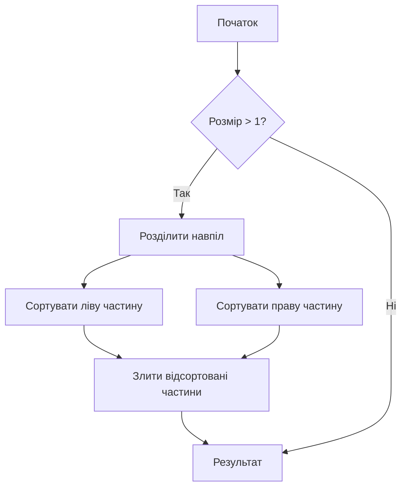
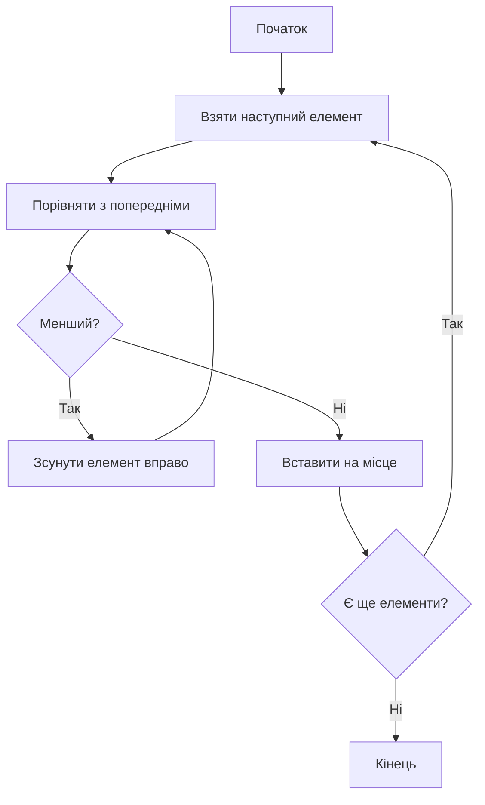
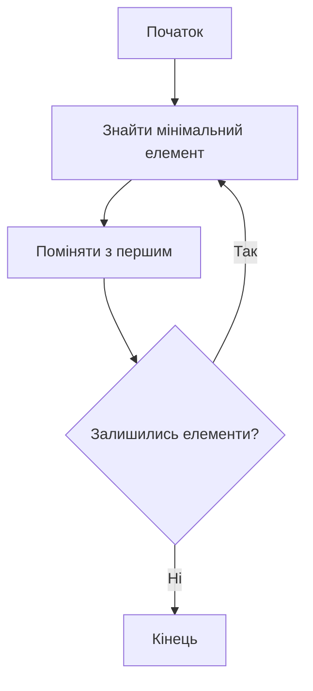
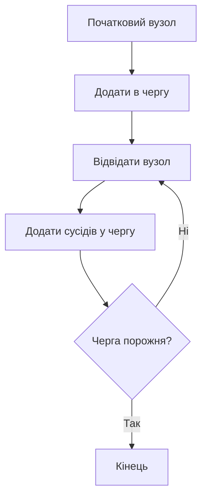
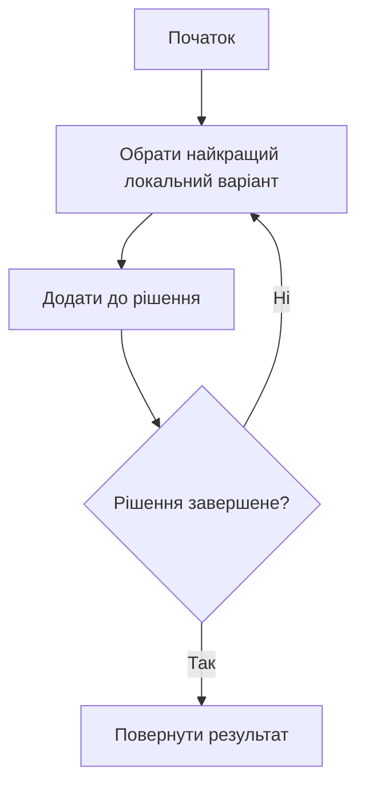
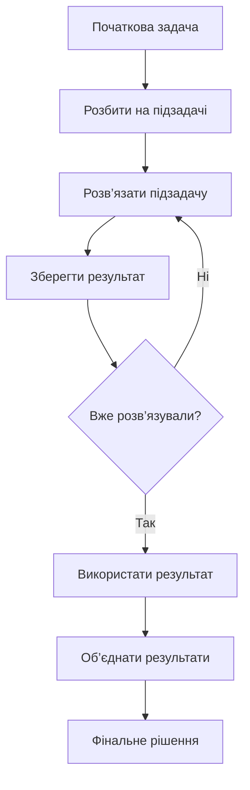
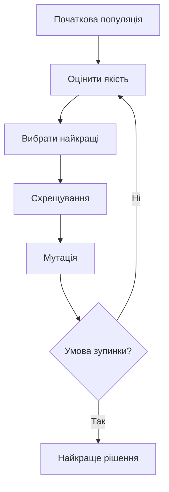

# 🧠 Вступ до алгоритмів

---

## 💥 Що таке алгоритм

**Алгоритм** — це чітка, скінченна послідовність кроків, яка приводить до розв’язання задачі.

> Іншими словами:  
> алгоритм — це відповідь на питання  
> **“як саме ми досягаємо результату?”**

---

## ⚙️ Простий приклад

Задача: знайти число у списку

Є два підходи:

>-   **Лінійний пошук** — перевіряємо кожен елемент
>-   **Бінарний пошук** — ділимо список навпіл

 * 👉 Результат однаковий
 * 👉 але ефективність — різна

---

## 🔥 Чому алгоритми важливі

Одна і та сама задача може виконуватись:

- ⚡ за 1 секунду  
- 🐢 або за роки  

👉 Різниця = алгоритм

---

# 🧠 Основні типи алгоритмів

---

## 🔍 1. Алгоритми пошуку

### 📌 Ідея:
Знайти потрібний елемент у даних

### 📖 Пояснення:

Алгоритми пошуку відповідають на питання:

> “де знаходиться потрібне значення?”

---

### Mermaid схема (лінійний пошук):

```mermaid
flowchart TD
    A[Початок] --> B{Елемент знайдено?}
    B -- Ні --> C[Перевірити наступний елемент]
    C --> B
    B -- Так --> D[Повернути результат]
    D --> E[Кінець]
````

---

## 🔄 2. Алгоритми сортування

### 📌 Ідея:
Впорядкувати дані для:
- швидкого пошуку
- аналізу
- оптимізації

---

## 🫧 Bubble Sort (пузиркове сортування)

### 📖 Суть:
Постійно порівнюємо сусідні елементи і “виштовхуємо” найбільші в кінець

👉 Дуже простий, але повільний

```mermaid
flowchart TD
    A[Початок] --> B[Порівняти сусідні елементи]
    B --> C{Потрібна перестановка?}
    C -- Так --> D[Поміняти місцями]
    C -- Ні --> E[Залишити як є]
    D --> E
    E --> F{Кінець проходу?}
    F -- Ні --> B
    F -- Так --> G{Список відсортований?}
    G -- Ні --> B
    G -- Так --> H[Кінець]
````

---

## ⚡ QuickSort (швидке сортування)

### 📖 Суть:

* обираємо опорний елемент (pivot)
* ділимо на:

  * менші
  * більші
* рекурсивно сортуємо

👉 дуже швидкий у середньому

```mermaid
flowchart TD
    A[Початок] --> B[Обрати опорний елемент]
    B --> C[Розділити на менші і більші]
    C --> D{Підмасив > 1 елемент?}
    D -- Так --> E[Рекурсивно сортувати]
    D -- Ні --> F[Залишити як є]
    E --> G[Об'єднати результати]
    F --> G
    G --> H[Кінець]
```

---

## 🔗 Merge Sort (злиття)

### 📖 Суть:

* ділимо список навпіл
* сортуємо частини
* зливаємо назад

👉 стабільний, добре працює на великих даних



---

## 🏗️ Insertion Sort (вставками)

### 📖 Суть:

* беремо елемент
* вставляємо його в правильне місце у вже відсортованій частині

👉 добре працює на майже відсортованих даних



---

## 🔽 Selection Sort (вибором)

### 📖 Суть:

* шукаємо мінімальний елемент
* ставимо його на початок
* повторюємо

👉 простий, але неефективний



---

# 🎯 Порівняння

| Алгоритм       | Складність | Коли використовувати |
| -------------- | ---------- | -------------------- |
| Bubble Sort    | O(n²)      | Для розуміння        |
| Selection Sort | O(n²)      | Для навчання         |
| Insertion Sort | O(n²)      | Маленькі дані        |
| QuickSort      | O(n log n) | Загальні задачі      |
| Merge Sort     | O(n log n) | Великі дані          |

---

# 💬 Ключова думка

> Сортування — це не про “поставити по порядку”
> це про **підготовку даних для ефективних алгоритмів**


---

## 🌳 3. Алгоритми на графах

### 📌 Ідея:

Працювати зі зв’язками між об’єктами

### 📖 Пояснення:

Графи використовуються, коли є:

* дороги
* мережі
* залежності

---

### Mermaid схема (BFS — пошук у ширину):



---

## ⚡ 4. Алгоритми оптимізації

### 📌 Ідея:

Знайти найкраще рішення серед багатьох

### 📖 Пояснення:

Ці алгоритми відповідають на питання:

> “яке рішення найкраще?”

Але часто:

* всі варіанти перебрати неможливо

---

### Mermaid схема (жадібний алгоритм):



---

## 🧠 5. Динамічне програмування

### 📌 Ідея:

Розбити задачу на підзадачі і не рахувати двічі

### 📖 Пояснення:

Якщо одна й та сама підзадача повторюється:

- 👉 ми її запам’ятовуємо
- 👉 і використовуємо повторно

---

### Mermaid схема:



---

## 🧬 6. Евристичні алгоритми

### 📌 Ідея:

Знайти хороше рішення, коли точне знайти складно

### 📖 Пояснення:

Використовуються, коли:

* задача занадто велика
* точне рішення займає дуже багато часу

---

### Mermaid схема (генетичний алгоритм):



---

# 📊 Таблиця алгоритмів (з практичним застосуванням)

| Категорія   | Алгоритм            | Складність | Де використовується (реально)                          |
|------------|--------------------|-----------|--------------------------------------------------------|
| Пошук       | Linear Search       | O(n)      | Пошук у невеликих списках, логах, CSV                  |
| Пошук       | Binary Search       | O(log n)  | Бази даних, індекси, API (sorted data)                 |
| Сортування  | Bubble Sort         | O(n²)     | Навчання (майже не використовується в продакшені)      |
| Сортування  | QuickSort           | O(n log n)| Вбудовані сортування (Python, Java)                    |
| Сортування  | Merge Sort          | O(n log n)| Великі дані, зовнішнє сортування (Big Data)            |
| Графи       | BFS                 | O(V + E)  | Найкоротший шлях (Google Maps без ваг)                 |
| Графи       | DFS                 | O(V + E)  | Аналіз залежностей, обходи структур                    |
| Оптимізація | Greedy              | O(n)      | Жадібні рішення: кеш, розклад, маршрути                |
| Оптимізація | Dynamic Programming | O(n²)+    | ML, фінанси, оптимізація ресурсів                      |
| Евристики   | Genetic Algorithm   | Залежить  | AI, складні оптимізації (TSP, параметри моделей)       |

---

# 🐍 Python приклади

---

## 🔍 Linear Search (пошук у списку)

```python
def linear_search(arr, target):
    for i, value in enumerate(arr):
        if value == target:
            return i
    return -1

data = [10, 20, 30, 40]
print(linear_search(data, 30))
````

👉 Використання:

* читання CSV
* пошук у невеликих даних

---

## 🔍 Binary Search (швидкий пошук)

```python
def binary_search(arr, target):
    left, right = 0, len(arr) - 1

    while left <= right:
        mid = (left + right) // 2

        if arr[mid] == target:
            return mid
        elif arr[mid] < target:
            left = mid + 1
        else:
            right = mid - 1

    return -1

data = [10, 20, 30, 40, 50]
print(binary_search(data, 40))
```

👉 Використання:

* бази даних
* індекси

---

## 🔄 Sorting (вбудоване сортування)

```python
data = [5, 2, 9, 1]

sorted_data = sorted(data)
print(sorted_data)
```

👉 Використання:

* будь-яка аналітика
* підготовка даних

---

## 🌳 BFS (найкоротший шлях)

```python
from collections import deque

graph = {
    'A': ['B', 'C'],
    'B': ['D'],
    'C': ['E'],
    'D': [],
    'E': []
}

def bfs(start):
    visited = set()
    queue = deque([start])

    while queue:
        node = queue.popleft()
        if node not in visited:
            print(node)
            visited.add(node)
            queue.extend(graph[node])

bfs('A')
```

👉 Використання:

* маршрути
* мережі

---

## 🌳 DFS (обхід графа)

```python
def dfs(node, visited=set()):
    if node not in visited:
        print(node)
        visited.add(node)
        for neighbor in graph[node]:
            dfs(neighbor, visited)

dfs('A')
```

👉 Використання:

* залежності
* дерева

---

## ⚡ Greedy (жадібний підхід)

```python
coins = [25, 10, 5, 1]

def greedy_change(amount):
    result = []
    for coin in coins:
        while amount >= coin:
            amount -= coin
            result.append(coin)
    return result

print(greedy_change(63))
```

👉 Використання:

* фінанси
* оптимізація

---

## 🧠 Dynamic Programming (Фібоначчі)

```python
def fib(n, memo={}):
    if n in memo:
        return memo[n]
    if n <= 2:
        return 1

    memo[n] = fib(n-1, memo) + fib(n-2, memo)
    return memo[n]

print(fib(10))
```

👉 Використання:

* оптимізація
* ML

---

## 🧬 Genetic Algorithm (простий приклад)

```python
import random

def fitness(x):
    return - (x - 5) ** 2

population = [random.randint(0, 10) for _ in range(10)]

for _ in range(10):
    population = sorted(population, key=fitness, reverse=True)
    population = population[:5] + [random.randint(0, 10) for _ in range(5)]

print(population[0])
```

👉 Використання:

* AI
* оптимізація параметрів

---

# 🎯 Висновок

👉 Алгоритми — це не просто “теорія”

Це:

* як працює Google
* як працює Amazon
* як працює твій ML pipeline

---

# 🎯 Головна ідея

> Алгоритми — це не про код
> це про **ефективний спосіб мислення**

---

# 🧠 Висновок

* Один результат → багато шляхів
* Різниця → у швидкості і ресурсах
* Алгоритми = вибір правильного підходу

---

