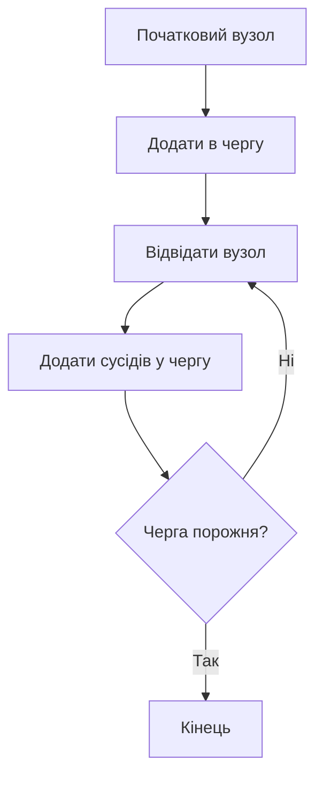
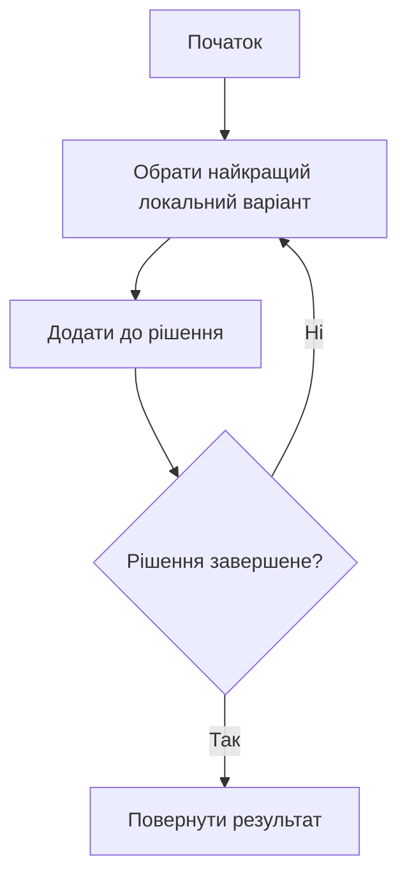
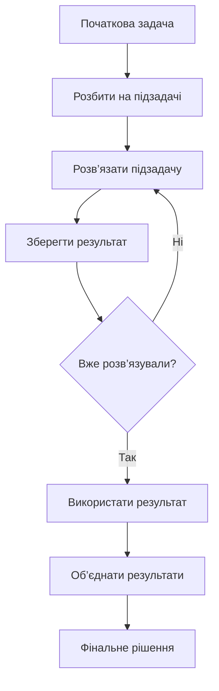
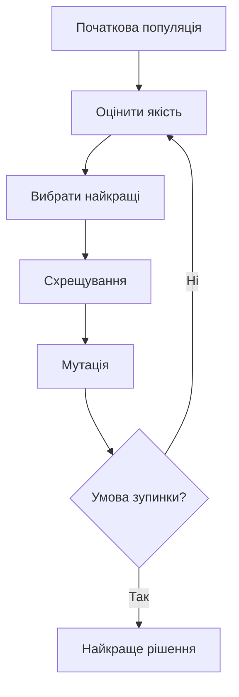

# 🧠 Вступ до алгоритмів

---

## 💥 Що таке алгоритм

**Алгоритм** — це чітка, скінченна послідовність кроків, яка приводить до розв’язання задачі.

> Іншими словами:  
> алгоритм — це відповідь на питання  
> **“як саме ми досягаємо результату?”**

---

## ⚙️ Простий приклад

Задача: знайти число у списку

Є два підходи:

>-   **Лінійний пошук** — перевіряємо кожен елемент
>-   **Бінарний пошук** — ділимо список навпіл

 * 👉 Результат однаковий
 * 👉 але ефективність — різна

---

## 🔥 Чому алгоритми важливі

Одна і та сама задача може виконуватись:

- ⚡ за 1 секунду  
- 🐢 або за роки  

👉 Різниця = алгоритм

---

# 🧠 Основні типи алгоритмів

---

## 🔍 1. Алгоритми пошуку

### 📌 Ідея:
Знайти потрібний елемент у даних

### 📖 Пояснення:

Алгоритми пошуку відповідають на питання:

> “де знаходиться потрібне значення?”

---

### Mermaid схема (лінійний пошук):

```mermaid
flowchart TD
    A[Початок] --> B{Елемент знайдено?}
    B -- Ні --> C[Перевірити наступний елемент]
    C --> B
    B -- Так --> D[Повернути результат]
    D --> E[Кінець]
````

---

## 🔄 2. Алгоритми сортування

### 📌 Ідея:

Впорядкувати дані для подальшої роботи

### 📖 Пояснення:

Сортування часто є підготовчим етапом для:

* пошуку
* аналітики
* оптимізації

---

### Mermaid схема (Bubble Sort):

```mermaid
flowchart TD
    A[Початок] --> B[Порівняти сусідні елементи]
    B --> C{Потрібна перестановка?}
    C -- Так --> D[Поміняти місцями]
    C -- Ні --> E[Перейти далі]
    D --> E
    E --> F{Кінець списку?}
    F -- Ні --> B
    F -- Так --> G[Список відсортовано]
```

---

## 🌳 3. Алгоритми на графах

### 📌 Ідея:

Працювати зі зв’язками між об’єктами

### 📖 Пояснення:

Графи використовуються, коли є:

* дороги
* мережі
* залежності

---

### Mermaid схема (BFS — пошук у ширину):



---

## ⚡ 4. Алгоритми оптимізації

### 📌 Ідея:

Знайти найкраще рішення серед багатьох

### 📖 Пояснення:

Ці алгоритми відповідають на питання:

> “яке рішення найкраще?”

Але часто:

* всі варіанти перебрати неможливо

---

### Mermaid схема (жадібний алгоритм):



---

## 🧠 5. Динамічне програмування

### 📌 Ідея:

Розбити задачу на підзадачі і не рахувати двічі

### 📖 Пояснення:

Якщо одна й та сама підзадача повторюється:

- 👉 ми її запам’ятовуємо
- 👉 і використовуємо повторно

---

### Mermaid схема:



---

## 🧬 6. Евристичні алгоритми

### 📌 Ідея:

Знайти хороше рішення, коли точне знайти складно

### 📖 Пояснення:

Використовуються, коли:

* задача занадто велика
* точне рішення займає дуже багато часу

---

### Mermaid схема (генетичний алгоритм):



---

# 📊 Таблиця алгоритмів

| Категорія   | Алгоритм            | Складність | Коли використовувати              |
| ----------- | ------------------- | ---------- | --------------------------------- |
| Пошук       | Linear Search       | O(n)       | Маленькі або неструктуровані дані |
| Пошук       | Binary Search       | O(log n)   | Відсортовані дані                 |
| Сортування  | Bubble Sort         | O(n²)      | Для навчання                      |
| Сортування  | QuickSort           | O(n log n) | Загальні задачі                   |
| Сортування  | Merge Sort          | O(n log n) | Великі дані, стабільність         |
| Графи       | BFS                 | O(V + E)   | Найкоротший шлях (без ваг)        |
| Графи       | DFS                 | O(V + E)   | Обхід і аналіз структури          |
| Оптимізація | Greedy              | O(n)       | Швидкі приблизні рішення          |
| Оптимізація | Dynamic Programming | O(n²)+     | Повторювані підзадачі             |
| Евристики   | Genetic Algorithm   | Залежить   | Дуже складні задачі               |

---

# 🎯 Головна ідея

> Алгоритми — це не про код
> це про **ефективний спосіб мислення**

---

# 🧠 Висновок

* Один результат → багато шляхів
* Різниця → у швидкості і ресурсах
* Алгоритми = вибір правильного підходу

---

