# 🧠 Основи Data Analytics: Патерни, Мислення та Структура

---

## 📊 Архітектурне бачення аналізу даних

```mermaid
flowchart TD
    RawData[Raw Data] --> Noise[Noise]
    RawData --> Signal[Signal]
    Signal --> Patterns[Patterns]
    Patterns --> Insight[Insight]
    Insight --> Decision[Decision]
````

---

# 1. Що таке аналіз даних (глибоке пояснення)

Аналіз даних часто сприймається хибно.

## ❌ Чим аналіз даних НЕ є

- не просто побудова красивих графіків  
- не сліпе застосування математичних формул  
- не технічна робота з написання коду для бази даних  

---

## ✅ Чим він є насправді

Аналіз даних — це **дисциплінований процес мислення та дослідження доказів**,  
спрямований на те, щоб перетворити сирі, хаотичні числа на інтелект,  
який стимулює реальні дії та бізнес-рішення.

Аналітик виступає в ролі **детектива**,  
який розв'язує загадки, приховані у масивах інформації.

---

## 🔍 Рівні аналітики (Analytics Maturity Model)

Щоб мислити аналітично, необхідно чітко розрізняти рівні роботи з даними.  
Ці рівні утворюють **ієрархію аналітичної зрілості (Analytics Maturity Model)**, де кожен наступний рівень:

- складніший технічно
- дає глибше розуміння
- приносить більшу бізнес-цінність

---

## 🧠 Загальна архітектура

```mermaid
flowchart LR
    Descriptive --> Diagnostic --> Predictive --> Prescriptive
````

---

## 📊 1.1. Описова аналітика (Descriptive Analytics) — "Що відбулося?"

**Ключове питання:**
👉 *Що відбулося?*

---

### 📌 Суть

Це базовий рівень аналітики, який фокусується на:

* фактах
* історичних даних
* поточному стані системи

---

### ⚙️ Архітектура

* Aggregation (mean, sum, count)
* BI системи (дашборди)
* SQL / pandas groupby

---

### 🧠 Ментальна модель

👉 "Дзеркало заднього виду"

```mermaid
flowchart LR
    Data --> Aggregation --> KPI --> Dashboard
```

---

### 📉 Приклад

* Продажі = 1 млн грн
* Конверсія = 3.2%
* Трафік впав на 20%

---

### ⚠️ Обмеження

* НЕ пояснює причину
* НЕ дає рішення
* НЕ прогнозує майбутнє

---

## 🔍 1.2. Діагностична аналітика (Diagnostic Analytics) — "Чому це відбулося?"

**Ключове питання:**
👉 *Чому це сталося?*

---

### 📌 Суть

Це рівень пошуку причин:

* аналіз зв’язків
* розкладка системи на компоненти
* перевірка гіпотез

---

### ⚙️ Архітектура

* Correlation analysis
* Root cause analysis
* Drill-down / slice & dice
* A/B аналіз

---

### 🧠 Ментальна модель

👉 "Рентген системи"

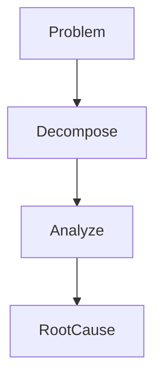

---

### 📉 Приклад

Було:
👉 продажі впали

Стало:
👉 падіння через:

* мобільний трафік ↓
* SEO ↓
* конкуренти ↑

---

### ⚠️ Обмеження

* не дає точного прогнозу
* може помилятись через:

  * кореляції
  * шум

---

## 🔮 1.3. Прогностична аналітика (Predictive Analytics) — "Що може відбутися?"

**Ключове питання:**
👉 *Що може відбутися?*

---

### 📌 Суть

Це рівень моделювання майбутнього:

* пошук патернів
* побудова моделей
* оцінка ймовірностей

---

### ⚙️ Архітектура

* Machine Learning
* Statistical models
* Time series
* Regression

---

### 🧠 Ментальна модель

👉 "Ймовірнісна кришталева куля"


---

### 📉 Приклад

- 👉 клієнт піде з імовірністю 85%
- 👉 попит зросте на 12%
- 👉 ризик повені = 0.67

---

### ⚠️ ВАЖЛИВО

```text
Predictive ≠ certainty
```

- 👉 це НЕ правда
- 👉 це ймовірність

---

## ⚖️ 1.4. Приписова аналітика (Prescriptive Analytics) — "Що робити?"

**Ключове питання:**
- 👉 *Що нам робити?*

---

### 📌 Суть

Це найвищий рівень:

- 👉 система не просто аналізує
- 👉 вона **рекомендує дію**

---

### ⚙️ Архітектура

* Optimization
* Simulation (Monte Carlo)
* Decision systems
* Reinforcement Learning

---

### 🧠 Ментальна модель

👉 "Меню рішень"

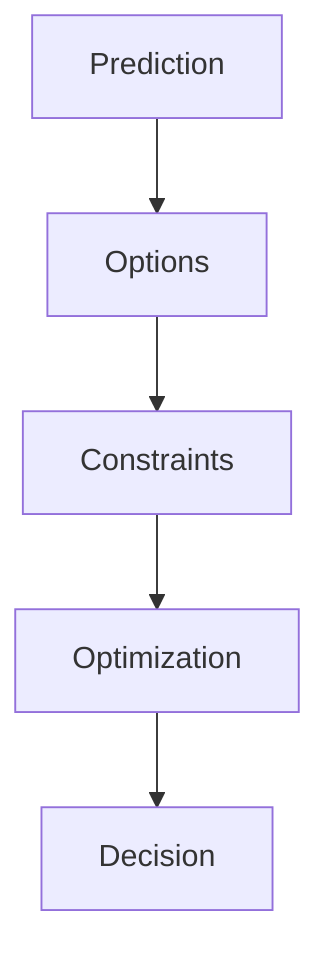

---

### 📉 Приклад

Було:

👉 якщо ціна +5% → продажі -10%

Prescriptive:

👉 оптимально → +3.2%

---

### 🔥 Це рівень:

* AI систем
* автоматичних рішень
* recommendation engines

---

## 🔄 Повний аналітичний конвеєр


---

| Рівень       | Питання    | Результат   |
| ------------ | ---------- | ----------- |
| Descriptive  | Що сталося | Дані        |
| Diagnostic   | Чому       | Причини     |
| Predictive   | Що буде    | Ймовірність |
| Prescriptive | Що робити  | Рішення     |

---

## 🧠 ГОЛОВНИЙ ІНСАЙТ

```text
Аналітика = еволюція від спостереження → до дії
```

---

## 🚀 Аналітичне мислення

- 👉 ти не просто аналізуєш дані
- 👉 ти будуєш pipeline:

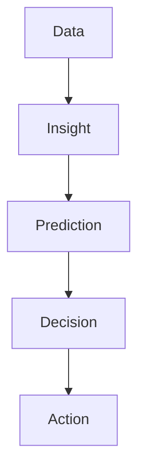

---
# 2. Основна ідея аналізу: "Знайти структуру"

Фундаментальна парадигма науки про дані:

```text
Дані = Інформація + Шум
````

---

### 🧠 Архітектурна модель

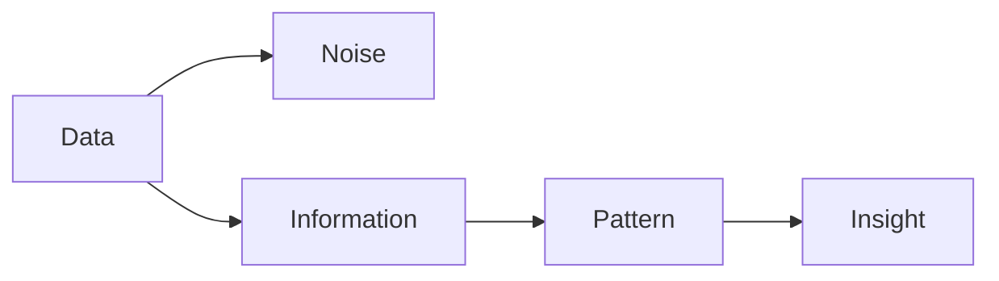

---

Сирі дані самі по собі не є корисною інформацією; вони є лише "сховищем", де справжня інформація затуманена випадковим шумом.

👉 **Головна задача аналітика** — відфільтрувати шум і знайти сигнал.

---

### 🔍 ГЛИБИННЕ РОЗУМІННЯ (Архітектура мислення)

З точки зору архітектури мислення, робота з даними починається з усвідомлення:

👉 **дані ≠ інформація**

Сирі дані — це:

* безформний потік чисел
* результат роботи системи
* "тінь" реального процесу

---

### 🧠 Ключова ідея

```text
Дані — це не знання
Дані — це носій потенційного знання
```

---

### 🧬 Розширена модель

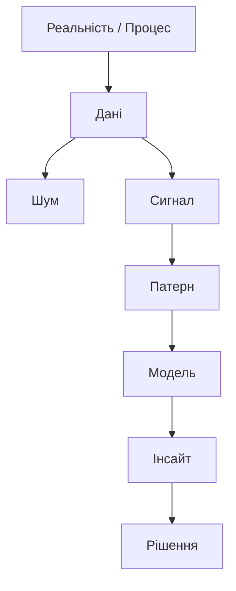

---

## ⚖️ 2.1. Рівняння реальності: Дані = Інформація + Шум

Головне завдання науки про дані — витягнути **інформацію з шуму**.

Але важливо:

- 👉 не будь-яку інформацію
- 👉 а **багату (rich)**

---

### 🟡 Типи інформації

### ❌ Бідна інформація (Poor Information)

* середні значення без контексту
* загальні метрики без структури
* "цікаво, але не корисно"

👉 приклад:

* середній дохід = 1000$

(але без розподілу це нічого не означає)

---

### ✅ Багата інформація (Rich Information)

* дієва (actionable)
* пояснює систему
* дозволяє приймати рішення

👉 приклад:

* сегмент A дає 80% прибутку
* клієнти з X поведінкою йдуть через 2 тижні

---

### 🧠 Архітектурний принцип

```text
Не кожна інформація = інсайт
```

---

## 🧹 2.2. Фільтрація шуму (Signal Extraction)

Шум — це:

* випадковість
* похибки
* нерелевантні варіації

---

### 🧠 Як прибирається шум

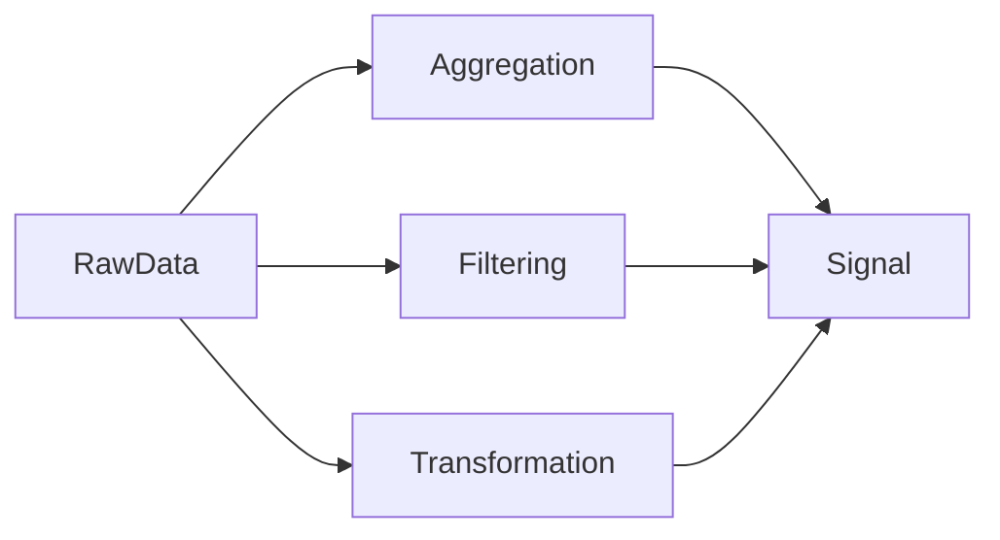

---

### ⚙️ Основні інструменти

* Aggregation (mean, median)
* Filtering
* Smoothing (rolling mean)
* Feature engineering

---

### 📉 Приклад (критичний)

👉 погодинні ціни акцій:

* хаос
* шум

👉 денні:

* видно тренд

---

### 🧠 Висновок

```text
Шум = короткострокова випадковість
Сигнал = довгострокова закономірність
```

---

## 🔗 2.3. Закономірність (Pattern) як відображення системи

Закономірність — це не просто тренд.

👉 Це **структура системи**

---

### 🧠 Визначення

Pattern =

* повторюваність
* залежність
* структура взаємозв’язків

---

### 🧬 Архітектурна модель

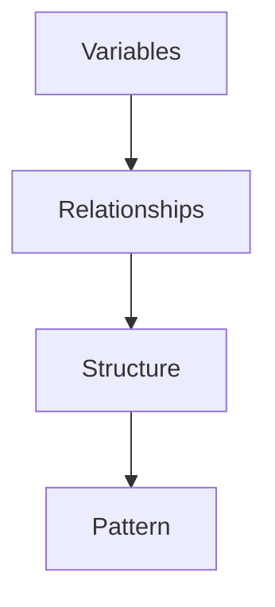

---

### 📊 Типи патернів

* тренд (trend)
* сезонність (seasonality)
* залежність (correlation)
* кластер (clusters)
* розподіл (distribution shape)

---

### 📉 Приклад

👉 skewed distribution

→ означає:

* більшість малих значень
* few extreme values

---

### 🧠 Ключова ідея

```text
Pattern = compressed knowledge about system
```

---

## 🔍 2.4. Pattern → Модель

Коли знайдений патерн:

👉 його можна формалізувати

---

### 🧠 Перехід

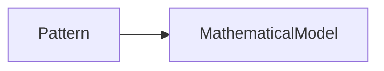

---

### 📌 Це означає:

* ти описав систему
* ти можеш її відтворити
* ти можеш її передбачити

---

## 🔮 2.5. Від структури до прогнозу

👉 структура = основа прогнозу

---

### 🧠 Логіка

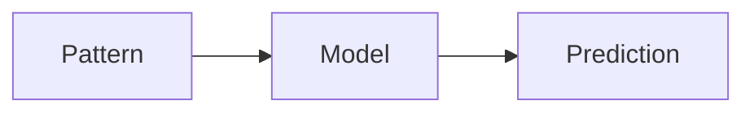

---

### 📌 Інсайт

Якщо ти знаєш:

* як система поводиться
* як змінні пов’язані

👉 ти можеш передбачити:

* реакцію системи
* майбутні значення

---

## 🧠 2.6. Візуалізація як інструмент пошуку структури

Проблема:

👉 патерни заховані в таблицях

---

### 🔍 Рішення

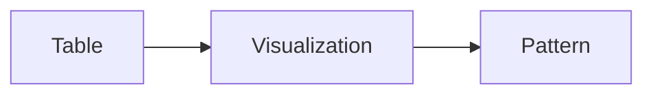

---

### 📌 Чому це працює

* мозок краще бачить структуру в образах
* графік = компресія даних

---

## ⚠️ 2.7. Аномалії: шум чи сигнал?

Не все, що виглядає як шум — це шум.

---

### 🧠 Варіанти

* ❌ помилка
* ❗ новий патерн
* 🚨 критичний сигнал

---

### 📌 Приклад

* різкий spike → може бути:

  * баг
  * атака
  * новий тренд

---

## 🧠 2.8. Найглибший рівень

```text
Дані — це відображення системи
Патерн — це структура системи
Інсайт — це розуміння системи
```

---

## 🔥 ФІНАЛЬНИЙ ВИСНОВОК

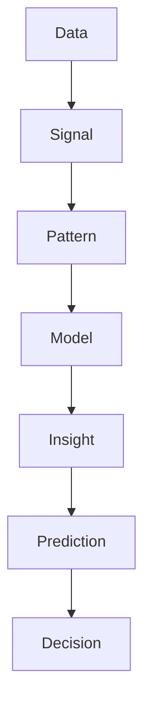

---

## 🧠 Головна ідея

```text
Знайти структуру = перетворити хаос у передбачувану систему
```

---

## 🚀 Аналітик мислить так:

* не "що показує графік"
* а:

```text
Яка система породила ці дані?
Яка її структура?
Як вона зміниться?
```

___

#  3. Головні патерни аналізу даних

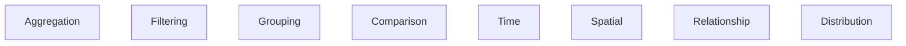

---

## 📊 3.1. Aggregation (Агрегація)

Агрегація згортає тисячі рядків у єдині метрики.

* Mean (середнє) — чутливе до викидів  
* Median (медіана) — стійка до викидів  
* Sum — загальний обсяг  

❗ Ніколи не змішувати різні одиниці виміру  

---

### 🧠 Архітектура агрегації

З точки зору аналітичного мислення:

👉 **Агрегація = стиснення даних (data reduction)**

---

### 📦 Модель

```mermaid
flowchart LR
    RawData[Тисячі рядків] --> Aggregation
    Aggregation --> Metric[1 число]
````

---

### 🧠 Глибинна ідея

```text
Агрегація = компресія інформації
```

---

### 🔍 Зв’язок із парадигмою

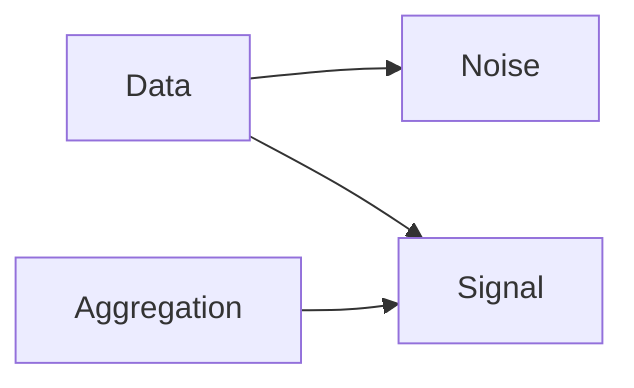

👉 агрегація:

* прибирає шум
* підсилює сигнал
* показує структуру

---

### ⚖️ Mean (Середнє) — центр масиву

### 📌 Визначення

```text
Mean = сума всіх значень / кількість
```

---

### 🧠 Ментальна модель

👉 "центр маси"

---

### ⚠️ Проблема

Mean використовує ВСІ значення:

👉 навіть аномалії

---

### 📉 Приклад

```text
[10, 12, 11, 9, 1000]

Mean = 208 ❌
```

---

### 🧠 Висновок

```text
Mean = чутливий до викидів
```

---

### 🔧 Просунуті варіації Mean

####  Trimmed Mean (усічене середнє)


---

#### 📌 Ідея

* відкидаємо крайні значення
* рахуємо середнє

---

#### 📉 Приклад

```text
10% зверху і знизу видалено
```

---

#### 🧠 Сенс

👉 робастна оцінка

---

### Weighted Mean (зважене середнє)

```text
Mean = Σ(x * weight) / Σ(weight)
```

---

#### 📌 Використання

* різна важливість даних
* різна точність сенсорів
* imbalance даних

---

#### 🧠 Приклад

* датчик A → точний → вага 0.8
* датчик B → шумний → вага 0.2

---

#### 🔥 Висновок

```text
Mean ≠ одна формула
Mean = клас моделей
```

---

### ⚖️ Median (Медіана) — центр порядку

#### 📌 Визначення

👉 50-й процентиль

---

#### 🧠 Ментальна модель

👉 "позиція, а не величина"

---

#### 📉 Приклад

```text
[10, 12, 11, 9, 1000]

Median = 11 ✅
```

---

#### 🔥 Чому вона працює

👉 ігнорує magnitude викидів

---

#### 🧠 Висновок

```text
Median = робастна метрика
```

---

#### 📌 Коли використовувати

* skewed data
* outliers
* доходи
* ціни

---

### 📊 Mode (Мода) — найчастіше значення

#### 📌 Визначення

👉 найпоширеніше значення

---

#### 🧠 Архітектура

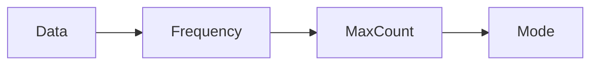

---

#### 📌 Використання

* категоріальні дані
* класи
* події

---

#### 📉 Приклад

```text
["A", "A", "B", "C"] → Mode = A
```

---

### ⚖️ Sum (Сума) — загальний обсяг

#### 📌 Суть

👉 cumulative signal

---

#### 🧠 Використання

* фінанси
* обсяг
* потоки

---

#### ⚠️ Обмеження

👉 залежить від масштабу

---

### ⚠️ КРИТИЧНИЙ АНТИПАТЕРН

#### ❌ Mixing units

```text
метри + кілограми = ❌
день + місяць = ❌
```

---

#### 🧠 Чому це ламає систему

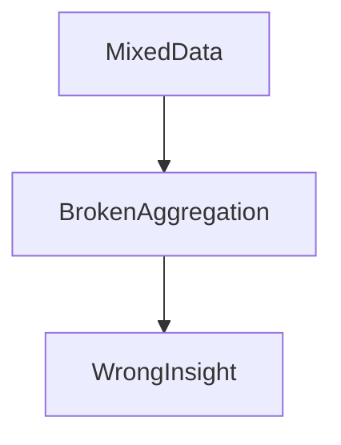

---

#### 📌 Проблема

* різна гранулярність
* різні одиниці
* різний контекст

---

#### ✅ Рішення

```text
Normalize → Aggregate
```

---

### 📊 Гранулярність (Granularity)

#### 📌 Визначення

👉 рівень деталізації даних

---

#### 🧠 Приклад

* година
* день
* місяць

---

#### ⚠️ Критично

```text
Aggregation працює тільки на одному рівні
```

---

#### 📉 Приклад помилки

* тиждень (7 днів)
* робочий тиждень (5 днів)

→ середнє = ❌

---

#### 🧠 Aggregation як Signal Extractor

```mermaid
flowchart LR
    RawData --> Noise
    RawData --> Aggregation --> Signal
```

---

#### 📌 Суть

👉 агрегація:

* приглушує шум
* показує тренд
* виявляє структуру

---

#### 📉 Приклад (критичний)

👉 погодинні дані:

* хаос

👉 денні:

* тренд

---

### 🔬 Aggregation → Pattern → Insight

```mermaid
flowchart TD
    Data --> Aggregation --> Pattern --> Insight
```

---

### 🧠 Висновок

```text
Без агрегації немає патерну
Без патерну немає інсайту
```

---

### 🔥 ФІНАЛЬНИЙ ІНСАЙТ

```text
Агрегація — це не просто функція
Агрегація — це інструмент мислення
```

---

### 🚀 Як мислить аналітик

👉 не:

"я рахую середнє"

👉 а:

```text
Я стискаю систему до сигналу
```

## 🔍 3.2. Filtering (Фільтрація)

Фільтрація — це відсікання шуму.

👉 ізоляція підмножини даних

---

### 🧠 Архітектурна суть фільтрації

З точки зору аналітика та архітектора даних:

👉 **Фільтрація — це не просто WHERE**

👉 це:

```text
Об'єктив / лінза / мікроскоп
````

---

#### 🧬 Базова модель

```mermaid
flowchart LR
    RawData --> Filter
    Filter --> Subset
```

---

### 🧠 Глибинна ідея

```text id="f1m6m1"
Фільтрація = керування тим, що ти бачиш
```

---

### ⚖️ Фільтрація як відділення сигналу від шуму

Реальні дані завжди:

* брудні
* змішані
* надлишкові

---

#### 🧬 Модель сигналу

```mermaid
flowchart TD
    Data --> Noise
    Data --> Signal
    Filter --> Signal
```

---

### 📌 Типи шуму

#### 🔹 Фізичний шум

* похибки сенсорів
* випадкові коливання

#### 🔹 Семантичний шум

* нерелевантні записи
* дублікати
* нецільові об'єкти

---

### 🧠 Висновок

```text id="2f7bzc"
Фільтрація = бар'єр між хаосом і змістом
```

---

### 🔬 Фільтрація в різних доменах

#### 🧾 NLP (тексти)

```mermaid
flowchart LR
    Text --> StopWordsRemoval --> MeaningfulWords
```

* стоп-слова → шум
* ключові слова → сигнал

---

#### 🔊 Сигнали / аудіо

* low-pass filter → прибирає високочастотний шум
* smoothing → згладжує

---

#### 🖼️ Зображення

* median filter → прибирає "зерно"
* gaussian → згладжування

---

#### 📊 Логи / системи

```mermaid
flowchart LR
    Logs --> FilterErrors --> UsefulData
```

👉 беремо тільки:

* error
* warning
* specific event

---

### 🧠 Узагальнення

```text id="g6psxg"
Фільтрація — універсальний патерн у всіх системах
```

---

### 🎯 Цільовий та гранулярний аналіз

Фільтрація дозволяє:

👉 змінювати контекст аналізу

---

### 🧬 Архітектура EDA

```mermaid
flowchart TD
    Data --> Filter
    Filter --> Subset
    Subset --> Analysis
```

---

### 📌 Ізоляція феноменів

👉 приклад:

* тільки жінки 25–34
* тільки high-value клієнти

---

### 🧠 Інсайт

```text id="3k9w0g"
Без фільтрації всі патерни змішуються
```

---

### 🧪 Фільтрація як основа експериментів

Фільтрація = база для:

* A/B тестів
* клінічних досліджень
* causal inference

---

### 🧬 Архітектура

```mermaid
flowchart LR
    Population --> Filter --> GroupA
    Population --> Filter --> GroupB
```

---

### 📌 Суть

👉 створити контрольовані групи

---

### 🧠 Критично

```text id="b4hytg"
Без фільтрації немає валідного експерименту
```

---

### 🔗 Group-level Filtering (просунутий патерн)

Фільтрація не тільки по рядках.

👉 а по групах

---

### 🧬 Модель

```mermaid
flowchart TD
    Data --> GroupBy
    GroupBy --> Aggregate
    Aggregate --> FilterGroups
```

---

### 📌 Приклад

👉 залишити тільки:

* групи з revenue > 10000
* регіони з population > X

---

### 🧠 Висновок

```text id="x7s48m"
Фільтрація працює на рівні структури
```

---

### ⚡ Фільтрація як оптимізація системи

У Big Data:

👉 фільтрація = виживання

---

### 🧬 Pipeline

```mermaid
flowchart LR
    RawData --> EarlyFilter --> SmallData --> Processing
```

---

### 📌 Ефект

* менше RAM
* менше CPU
* швидші моделі
* менший latency

---

### 🧠 Принцип

```text id="z9m2t1"
Filter early → compute fast
```

---

### ⚠️ КРИТИЧНІ РИЗИКИ

#### ❌ Видалення валідних даних

👉 ти можеш:

* прибрати шахрайство
* прибрати аномалію
* втратити сигнал

---

#### ❌ Bias (упередженість)

```mermaid
flowchart TD
    Data --> Filter --> BiasedData --> WrongModel
```

---

#### 📌 Приклад

* тільки активні користувачі
  → ignore churn

---

#### ❌ Over-filtering

👉 занадто вузька вибірка

→ немає статистики

---

### 🧠 Висновок

```text id="j7z9bb"
Фільтрація може зруйнувати реальність
```

---

### 🧠 Фільтрація як контроль реальності

```mermaid
flowchart TD
    Reality --> Data --> Filter --> Interpretation
```

---

### 📌 Ключова ідея

👉 те, що ти відфільтрував:

= те, що ти аналізуєш

---

### 🧠 Data аналітик думає так:

```text id="kmj8cm"
Що я прибрав?
Що я залишив?
Що я втратив?
```

---

### 🔥 ФІНАЛЬНИЙ ІНСАЙТ

```text id="y2xmfz"
Фільтрація — це не про дані
Фільтрація — це про контроль уваги
```

---

### 🚀 ВИСНОВОК

```mermaid
flowchart LR
    Data --> Filter --> Subset --> Insight
```

---

- 👉 якщо агрегація = стиснення
- 👉 то фільтрація = фокус

---
## 📈 3.3 Grouping (Групування)

```mermaid
flowchart LR
    Data --> Split --> Apply --> Combine
````

Розділити → застосувати → об'єднати

---

### 🧠 Архітектурна суть групування

Групування — це не просто технічна операція.

👉 це:

```text
спосіб мислення про структуру
```

---

### 🧬 Ментальна модель

Люди природно:

* класифікують
* групують
* створюють категорії

👉 щоб зрозуміти світ

---

### 🧠 В аналітиці

```text id="g8e4pb"
Grouping = примус системи показати структуру
```

---

### 🔍 1. Split-Apply-Combine (ядро всього)

Це фундамент:

* SQL
* pandas
* Spark
* Big Data

---

#### 🧬 Архітектура

```mermaid
flowchart TD
    Data --> Split
    Split --> Groups
    Groups --> Apply
    Apply --> Results
    Results --> Combine
    Combine --> Output
```

---

#### 📌 Split (Розділити)

👉 дані діляться за ключем:

* категорія
* регіон
* клас

---

#### 📌 Apply (Застосувати)

👉 до кожної групи:

* mean
* sum
* count
* custom logic

---

#### 📌 Combine (Об'єднати)

👉 отримуємо нову структуру:

* компактну
* зрозумілу
* інтерпретовану

---

#### 🧠 Висновок

```text id="kz5u3p"
Grouping = структуризація хаосу
```

---

### 📊 2. Групування як пошук структури

Без групування:

* дані = шум
* немає сегментів
* немає різниці

---

#### 🧬 Модель

```mermaid
flowchart LR
    RawData --> Grouping --> Structure --> Insight
```

---

#### 📌 Приклад

👉 загальні продажі = 1 млн

❌ нічого не ясно

👉 по регіонах:

* Захід → 500k
* Центр → 300k
* Схід → 200k

✅ структура з'явилась

---

#### 🧠 Інсайт

```text
Grouping = різниця між "дані" і "розуміння"
```

---

### 🎯 3. Сегментація (Business View)

Grouping → segmentation

---

#### 🧬 Архітектура

```mermaid
flowchart TD
    Population --> Grouping --> Segments --> Strategy
```

---

#### 📌 Типи сегментації

##### 🔹 Демографічна

* вік
* стать
* дохід

---

##### 🔹 Поведінкова

* покупки
* активність
* retention

---

#### 📌 Чому це критично

👉 різні групи ≠ одна поведінка

---

#### 📉 Приклад

* підлітки → TikTok
* дорослі → LinkedIn

---

#### 🧠 Висновок

```text id="9g1qfp"
Без сегментації бізнес = сліпий
```

---

### 🤖 4. Кластеризація (ML рівень)

Якщо груп немає:

👉 їх створює алгоритм

---

#### 🧬 Архітектура

```mermaid 
flowchart LR
    Data --> Distance
    Distance --> Clustering
    Clustering --> Clusters
```

---

#### 📌 Алгоритми

* k-means
* hierarchical clustering
* DBSCAN

---

#### 📌 Суть

👉 максимальна схожість всередині
👉 максимальна різниця між групами

---

#### 🧠 Висновок

```text id="2nj0hs"
Clustering = автоматичне grouping
```

---

### 🏗️ 5. Ієрархічне групування (Multi-level)

Grouping стає потужним при:

👉 багаторівневій структурі

---

#### 🧬 Приклад

```mermaid 
flowchart TD
    Country --> Region --> City --> Store
```

---

#### 📌 Інші приклади

* компанія → відділ → команда
* річка → басейн → суббасейн

---

#### 🧠 Операції

* roll-up (узагальнення)
* drill-down (деталізація)

---

#### 📊 Модель

```mermaid 
flowchart LR
    Detail --> Aggregate --> Summary
    Summary --> DrillDown --> Detail
```

---

#### 📌 Приклад

👉 продажі:

* Україна → 10M
* Захід → 4M
* Львів → 1M

---

#### 🧠 Висновок

```text id="q2i6m7"
Ієрархія = контроль масштабу аналізу
```

---

### ⚙️ 6. Grouping у Data Pipeline

Grouping = ключова операція

---

#### 🧬 Pipeline

```mermaid
flowchart LR
    RawData --> Filter --> Group --> Aggregate --> Model
```

---

#### 📌 Де використовується

* feature engineering
* ML preprocessing
* dashboards
* OLAP

---

#### 🧠 Висновок

```text id="6dpq2o"
Без grouping немає feature engineering
```

---

### ⚠️ 7. Типові помилки

#### ❌ 1. Неправильний ключ

👉 неправильна категорія

→ знищена структура

---

#### ❌ 2. Занадто грубе grouping

👉 втрата деталей

---

#### ❌ 3. Занадто детальне grouping

👉 шум повертається

---

#### 🧠 Баланс

```text id="y1o7q2"
Granularity = ключ до правильного grouping
```

---

### 🔥 ФІНАЛЬНИЙ ІНСАЙТ

```text id="t2k6bn"
Grouping — це спосіб побачити систему через її частини
```

---

### 🚀 Як мислить архітектор

👉 не:

"я роблю groupby"

👉 а:

```text id="h9f8c3"
Я розкладаю систему на підсистеми
```

---

### 🧠 Рівні мислення

* джун → groupby
* мідл → сегментація
* сеньйор → ієрархії
* архітектор → структура системи

---

### 🔚 ВИСНОВОК

```mermaid
flowchart LR
    Data --> Grouping --> Structure --> Insight
```

---

👉 якщо:

* filtering = фокус
* aggregation = стиснення

👉 то:

```text id="0w3v7c"
Grouping = розкладання реальності на частини
```

## 🔄 3.4. Comparison (Порівняння)

Дані не мають сенсу без порівняння.

---

### 🧠 Архітектурна суть порівняння

Фундаментальне правило аналітики:

```text id="cmp_rule_1"
Метрика без контексту = 0 інсайту
````

---

### 🧬 Базова модель

```mermaid
flowchart LR
    Metric --> Compare --> Context --> Insight
```

---

### 🧠 Глибинна ідея

👉 будь-яке число:

* не має сенсу саме по собі
* має сенс тільки у відношенні

---

### 📉 Приклад

```text id="cmp_example_1"
Середній чек = 50$
```

❌ нічого не означає

---

```text id="cmp_example_2"
Було: 30$
Стало: 50$
```

✅ є сигнал

---

### 🧠 Висновок

```text id="cmp_rule_2"
Insight = різниця між станами
```

---

### 🔍 1. Закон відносності даних

Дані — відносні.

---

#### 🧬 Архітектура

```mermaid
flowchart TD
    Data --> ReferencePoint --> Comparison --> Insight
```

---

#### 📌 Типи референсів

* час (було → стало)
* група (A vs B)
* стандарт (benchmark)
* очікування (target)

---

#### 🧠 Ключова модель

```text id="cmp_rule_3"
Без reference point немає аналізу
```

---

### 🎯 2. Явність порівняння (Critical Skill)

Аналітик НЕ має:

👉 змушувати користувача думати

---

#### ❌ Погано

* "Retention = 40%"

---

#### ✅ Добре

* "Retention = 40% (було 25% минулого місяця)"

---

#### 🧠 Принцип

```text id="cmp_rule_4"
Comparison must be explicit
```

---

### 🧪 3. A/B Testing — вершина Comparison

Порівняння досягає максимуму тут:

👉 експерименти

---

#### 🧬 Архітектура

```mermaid
flowchart LR
    Population --> RandomSplit
    RandomSplit --> GroupA
    RandomSplit --> GroupB
    GroupA --> Measure
    GroupB --> Measure
    Measure --> Compare
```

---

#### 📌 Групи

* Control (контроль)
* Treatment (тест)

---

#### ❗ Чому це критично

Без контрольної групи:

```text id="cmp_rule_5"
немає причинно-наслідкового висновку
```

---

#### ⚠️ Проблема

```text id="cmp_problem_1"
сьогодні vs вчора ≠ експеримент
```

---

#### 📌 Причини

* погода
* сезонність
* конкуренти

---

#### 🧠 Висновок

```text id="cmp_rule_6"
Тільки контроль дозволяє ізолювати ефект
```

---

### 🎲 4. Рандомізація (ключ до істини)

```mermaid
flowchart TD
    Population --> Randomization --> EqualGroups --> FairComparison
```

---

#### 📌 Суть

👉 групи стають:

* статистично однаковими
* порівнюваними

---

#### 🧠 Висновок

```text id="cmp_rule_7"
Randomization = захист від bias
```

---

### 📊 5. Benchmarking (бізнес рівень)

Порівняння → оцінка ефективності

---

#### 🧬 Архітектура

```mermaid
flowchart LR
    EntityA --> Compare --> EntityB
    Compare --> Performance
```

---

#### 📌 Приклади

* доставка між складами
* кредитні рішення між філіями
* відгуки між продуктами

---

#### 📉 Приклад

```text id="cmp_example_3"
Склад A → 2 дні
Склад B → 5 днів
```

👉 оптимізація

---

#### 🧠 Висновок

```text id="cmp_rule_8"
Benchmarking = пошук кращого стану
```

---

### 🔗 6. Grouping + Comparison = ядро аналітики

Ці два патерни працюють разом.

---

#### 🧬 Архітектура

```mermaid
flowchart TD
    Data --> Grouping --> Segments --> Comparison --> Insight
```

---

#### 📌 Логіка

* Grouping → створює структуру
* Comparison → дає сенс

---

#### 🧠 Ключова ідея

```text id="cmp_rule_9"
Без grouping нічого порівнювати
Без comparison немає висновку
```

---

### ⚠️ 7. Типові помилки

#### ❌ 1. Відсутність бази

👉 порівнювати ні з чим

---

#### ❌ 2. Неправильний baseline

👉 неправильна група

---

#### ❌ 3. Змішування контекстів

```text id="cmp_problem_2"
різні періоди / різні умови
```

---

#### ❌ 4. Simpson’s Paradox

👉 агреговані дані вводять в оману

---

#### 🧠 Висновок

```text id="cmp_rule_10"
Comparison може як відкрити істину, так і зламати її
```

---

### 🔬 8. Comparison як оператор різниці

З математики:

```text id="cmp_math"
Δ = new - old
```

---

#### 🧬 Архітектура

```mermaid
flowchart LR
    State1 --> Difference --> State2
```

---

#### 📌 Типи різниці

* абсолютна
* відносна (%)
* логарифмічна

---

#### 🧠 Інсайт

```text id="cmp_rule_11"
Вся аналітика = аналіз різниць
```

---

### 🔥 ФІНАЛЬНИЙ ІНСАЙТ

```text id="cmp_final"
Порівняння — це механізм створення сенсу
```

---

### 🚀 Як мислить аналітик

👉 не:

"я дивлюсь на значення"

👉 а:

```text id="cmp_arch"
З чим це порівняти?
Що є baseline?
Яка різниця?
```

---

### 🔚 ВИСНОВОК

```mermaid
flowchart LR
    Data --> Grouping --> Comparison --> Insight --> Decision
```

---

👉 якщо:

* filtering = фокус
* aggregation = стиснення
* grouping = структура

👉 то:

```text id="cmp_final_2"
Comparison = сенс
```


## 📉 3.5. Time Analysis (Аналіз у часі)

```mermaid
flowchart LR
    Time --> Trend
    Time --> Seasonality
    Time --> Lags
````

---

### 🧠 Архітектурна суть часу

Час — це не просто ще одна колонка.

👉 це:

```text id="time_core"
вимір, який руйнує незалежність даних
```

---

### 🧬 Базова модель

```mermaid 
flowchart LR
    State_t-1 --> State_t --> State_t+1
```

---

### 🧠 Ключова ідея

```text id="time_rule_1"
Дані в часі = залежні
```

---

### ⚠️ Чому це критично

У класичній статистиці:

👉 припущення:

```text id="time_rule_2"
observations are independent
```

---

У time series:

👉 це НЕ правда

---

### 🧠 Висновок

```text id="time_rule_3"
Минуле впливає на майбутнє
```

---

### 🔬 1. Time Analysis = динаміка системи

```mermaid
flowchart TD
    System --> Time --> Evolution --> Pattern
```

---

#### 📌 Суть

Time analysis вивчає:

* зміну
* розвиток
* еволюцію

---

#### 🧠 Інсайт

```text id="time_rule_4"
Без часу немає причинності
```

---

### 📈 2. Trend (Тренд)

#### 📌 Визначення

👉 довгостроковий напрямок

---

#### 🧬 Модель

```mermaid 
flowchart LR
    Time --> Increasing
    Time --> Decreasing
```

---

#### 📉 Приклад

* попит ↑
* температура ↑
* рівень води ↓

---

#### 🧠 Проблема

Тренд маскує інші патерни

---

#### 🔧 Рішення: Detredning

```mermaid 
flowchart LR
    Data --> RemoveTrend --> Residual
```

---

#### 📌 Суть

- 👉 прибираємо тренд
- 👉 дивимось на залишок

---

#### 🧠 Висновок

```text id="trend_rule"
Тренд = глобальний сигнал
але не вся правда
```

---

### 🔁 3. Seasonality (Сезонність)

#### 📌 Визначення

👉 регулярні повторення

---

#### 🧬 Модель

```mermaid 
flowchart LR
    Cycle --> Repeat --> Pattern
```

---

#### 📉 Приклади

* продажі морозива ↑ влітку
* трафік ↓ у вихідні
* паводки весною

---

#### 🧠 Ментальна модель

👉 "серцебиття системи"

---

#### ⚠️ Критично

```text id="season_rule"
Сезонність ≠ аномалія
```

---

#### 📌 Чому це важливо

👉 дозволяє:

* відрізнити цикл від проблеми
* уникнути false alarms

---

#### 🧠 Висновок

```text id="season_rule_2"
Сезонність = нормальна поведінка системи
```

---

### 🔗 4. Lags (Лаги / Автокореляція)

#### 📌 Визначення

👉 залежність від минулого

---

#### 🧬 Модель

```mermaid 
flowchart LR
    X_t-1 --> X_t
    X_t-2 --> X_t
```

---

#### 📌 Суть

```text id="lag_rule_1"
Система має пам’ять
```

---

#### 📉 Приклад

* вчорашній дощ → сьогоднішній рівень води
* продажі вчора → продажі сьогодні

---

#### 🔬 Автокореляція

👉 вимір залежності:

```text id="lag_rule_2"
corr(X_t, X_t-k)
```

---

#### 🧠 Інсайт

```text id="lag_rule_3"
Минуле = предиктор майбутнього
```

---

### ⚙️ 5. Decomposition (розклад часу)

Time series можна розкласти:

---

#### 🧬 Архітектура

```mermaid
flowchart TD
    Data --> Trend
    Data --> Seasonality
    Data --> Noise
```

---

#### 📌 Формула

```text id="decomposition_formula"
Data = Trend + Seasonality + Noise
```

---

#### 🧠 Висновок

```text id="decomposition_rule"
Time series = сума патернів
```

---

### 🔮 6. Time → Prediction

```mermaid
flowchart LR
    Past --> Pattern --> Model --> Future
```

---

#### 📌 Суть

👉 якщо є:

* тренд
* сезонність
* лаги

👉 можна прогнозувати

---

#### 🧠 Інсайт

```text id="prediction_rule"
Час робить дані передбачуваними
```

---

### ⚠️ 7. Типові помилки

#### ❌ 1. Ігнорування часу

👉 treating as tabular data

---

#### ❌ 2. Ігнорування сезонності

👉 false anomalies

---

#### ❌ 3. Leakage

👉 використання майбутніх даних

---

#### ❌ 4. Неправильний лаг

👉 неправильна модель

---

#### 🧠 Висновок

```text id="time_errors"
Time series легко зламати
```

---

### 🧠 8. Аналітичне мислення

```mermaid 
flowchart TD
    System --> Time --> State --> Change --> Pattern
```

---

#### 📌 Як мислить аналітик

👉 не:

"я дивлюсь на значення"

👉 а:

```text id="time_arch_rule"
Як система змінюється у часі?
Що повторюється?
Що зростає?
Що залежить від минулого?
```

---

### 🔥 ФІНАЛЬНИЙ ІНСАЙТ

```text id="time_final"
Час перетворює дані на процес
```

---

### 🚀 ВИСНОВОК

```mermaid
flowchart LR
    Time --> Trend
    Time --> Seasonality
    Time --> Lags
    Trend --> Insight
    Seasonality --> Insight
    Lags --> Insight
```

---

👉 якщо:

* aggregation = стиснення
* filtering = фокус
* grouping = структура
* comparison = сенс

👉 то:

```text id="time_final_2"
Time = динаміка системи
```

___

## 🌍 3.6. Spatial Analysis (Просторовий аналіз)

Просторові дані → карти → кластери

---

### 🧠 Архітектурна суть простору

Дані майже ніколи не існують у вакуумі.

👉 вони завжди прив’язані до:

- координат  
- географії  
- фізичного середовища  

---

### 🧬 Базова модель

```mermaid
flowchart LR
    Reality --> Location
    Location --> SpatialData
    SpatialData --> Map
    Map --> Pattern
````

---

### 🧠 Ключова ідея

```text id="spatial_core"
Простір = прихований фактор, який пояснює поведінку
```

---

### 🔬 1. Простір як вимір системи

У табличних даних:

👉 простір "захований"

---

#### 🧬 Трансформація

```mermaid
flowchart LR
    Table --> Coordinates --> Map --> Insight
```

---

#### 📌 Приклад

Таблиця:

* місто
* продажі

👉 виглядає як шум

Карта:

* видно кластери

---

#### 🧠 Висновок

```text id="spatial_rule_1"
Карта = декомпресія просторової структури
```

---

### 🗺️ 2. Картування як інструмент мислення

Карти — це не візуалізація.

👉 це:

```text id="spatial_rule_2"
інструмент аналізу
```

---

#### 🧬 Типи карт

##### 📊 Choropleth (фонова карта)

* інтенсивність за регіоном

---

##### 📍 Point map (точки)

* окремі події

---

##### 🔥 Heatmap

* щільність

---

#### 🧠 Модель

```mermaid
flowchart TD
    Data --> Map --> VisualPattern --> Insight
```

---

#### 📌 Чому це працює

* мозок бачить простір краще ніж таблицю
* карта = стиснення складності

---

### 🔥 3. Кластери (Hotspots)

#### 📌 Визначення

👉 локальна концентрація

---

#### 🧬 Архітектура

```mermaid
flowchart LR
    Points --> Density --> Cluster
```

---

#### 📉 Приклади

* злочинність
* продажі
* flood zones

---

#### 🧠 Інсайт

```text id="spatial_rule_3"
Кластер = сигнал у просторі
```

---

### 🚨 4. Просторові аномалії

#### 📌 Визначення

👉 відхилення в просторі

---

#### 🧬 Модель

```mermaid
flowchart TD
    NormalArea --> Compare --> AnomalyArea
```

---

#### 📉 Приклад

* район з високими продажами
* зона з аномальним рівнем води

---

#### 🧠 Висновок

```text id="spatial_rule_4"
Аномалія = порушення просторового патерну
```

---

### 🔗 5. Простір як драйвер причинності

👉 простір впливає на:

* поведінку
* процеси
* результати

---

#### 🧬 Архітектура

```mermaid
flowchart LR
    Location --> Environment --> Behavior --> Data
```

---

#### 📌 Приклади

* біля університету → більше активності
* біля річки → ризик паводку
* біля дороги → більше трафіку

---

#### 🧠 Висновок

```text id="spatial_rule_5"
Location → причина, а не просто координата
```

---

### 🌊 6. Простір у гідрології (твій домен)

#### 🧬 Модель

```mermaid
flowchart TD
    Terrain --> Slope --> Runoff --> Flood
```

---

#### 📌 Фактори

* DEM
* slope
* land use
* distance to river

---

#### 📉 Приклад

* низина → накопичення води
* крутий схил → швидкий runoff

---

#### 🧠 Інсайт

```text id="spatial_rule_6"
Простір визначає рух води
```

---

### ⚙️ 7. Просторові операції (GIS логіка)

#### 🧬 Основні операції

* buffer
* intersection
* spatial join
* distance

---

#### 📌 Модель

```mermaid
flowchart LR
    Geometry --> Operation --> Result
```

---

#### 🧠 Приклад

👉 всі об'єкти в радіусі 10 км

---

### 🤖 8. Spatial + ML (GeoAI)

#### 🧬 Архітектура

```mermaid
flowchart TD
    SpatialData --> Features --> Model --> Prediction
```

---

#### 📌 Приклади

* flood prediction
* land classification
* DEM error modeling

---

#### 🧠 Інсайт

```text id="spatial_rule_7"
Простір → фіча для моделі
```

---

### ⚠️ 9. Типові помилки

#### ❌ 1. Ігнорування простору

👉 treating as tabular

---

#### ❌ 2. MAUP (modifiable area unit problem)

👉 різні масштаби → різні результати

---

#### ❌ 3. Spatial autocorrelation ignored

👉 залежність сусідніх точок

---

#### ❌ 4. Wrong projection

👉 координати спотворені

---

#### 🧠 Висновок

```text id="spatial_errors"
Простір легко спотворити
```

---

### 🧠 10. Аналітичне мислення

```mermaid
flowchart TD
    System --> Space --> Structure --> Pattern
```

---

#### 📌 Як мислить аналітик

👉 не:

"де знаходиться точка"

👉 а:

```text id="spatial_arch"
Як простір формує систему?
Де виникають кластери?
Чому саме тут?
```

---

### 🔥 ФІНАЛЬНИЙ ІНСАЙТ

```text id="spatial_final"
Простір перетворює дані на геометрію системи
```

---

### 🚀 ВИСНОВОК

```mermaid
flowchart LR
    Data --> Spatial --> Map --> Pattern --> Insight
```

---

👉 якщо:

* filtering = фокус
* aggregation = стиснення
* grouping = структура
* comparison = сенс
* time = динаміка

👉 то:

```text id="spatial_final_2"
Spatial = геометрія системи
```

---

## 🔗 3.7. Relationship Analysis (Зв’язки)

Кореляція ≠ причинність

---

### 🧠 Архітектурна суть зв’язків

Цей патерн відповідає на питання:

👉 *Як рух однієї змінної пов'язаний з рухом іншої?*

---

### 🧬 Базова модель

```mermaid
flowchart LR
    X --> Relationship --> Y
````

---

### 🧠 Глибинна ідея

```text id="rel_core"
Аналітика починається там, де з’являється взаємодія
```

---

### 📌 Перехід рівня

* Aggregation → одна змінна
* Grouping → структура
* Comparison → різниця

👉 Relationship:

```text id="rel_shift"
багатовимірне мислення
```

---

### 🔬 1. Кореляція (Correlation)

#### 📌 Визначення

👉 метрика зв’язку між змінними

---

#### 🧬 Формальна модель

```text id="rel_corr_formula"
corr(X, Y) ∈ [-1, +1]
```

---

#### 📊 Інтерпретація

| Значення | Значення                  |
| -------- | ------------------------- |
| +1       | ідеальна пряма залежність |
| 0        | немає зв’язку             |
| -1       | ідеальна зворотна         |

---

#### 🧠 Ментальна модель

```text id="rel_corr_model"
Кореляція = синхронізація руху
```

---

#### 📉 Приклад

* температура ↑ → продажі морозива ↑
* дощ ↑ → продажі морозива ↓

---

#### 🧬 Візуалізація

```mermaid
flowchart LR
    ScatterPlot --> Pattern --> Correlation
```

---

### ⚠️ 2. Кореляція ≠ Причинність (найважливіше правило)

```text id="rel_rule_1"
Correlation ≠ Causation
```

---

#### 🧠 Суть

- 👉 два процеси можуть рухатися разом
- 👉 але не впливати один на одного

---

#### 📉 Класичний приклад

```text id="rel_example_1"
Сонцезахисні окуляри ↑
Утоплення ↑
```

---

❌ неправильний висновок:

→ окуляри викликають утоплення

---

#### 🧠 Реальність

```mermaid
flowchart TD
    Heat --> Sunglasses
    Heat --> Swimming
    Swimming --> Drowning
```

---

👉 причина:

```text id="rel_hidden"
спека (confounder)
```

---

### 🔍 3. Confounding Variables (приховані фактори)

#### 📌 Визначення

👉 третя змінна, яка впливає на обидві

---

#### 🧬 Архітектура

```mermaid
flowchart TD
    Z --> X
    Z --> Y
```

---

#### 📌 Приклади

* температура → морозиво + продажі
* економіка → зарплати + ціни

---

#### 🧠 Висновок

```text id="rel_rule_2"
Аналітик шукає третю змінну
```

---

### 🔗 4. Типи зв’язків

#### 📊 1. Лінійний

```mermaid
flowchart LR
    X --> Y
```

---

#### 📊 2. Нелінійний

* U-shaped
* exponential

---

#### 📊 3. Монотонний

* зростає
* спадає

---

#### 📊 4. Немає зв’язку

* хаос

---

#### 🧠 Інсайт

```text id="rel_rule_3"
Кореляція ≠ тільки лінійність
```

---

### 🔬 5. Коваріація vs Кореляція

#### 📌 Covariance

```text id="rel_cov"
показує напрям
```

---

#### 📌 Correlation

```text id="rel_corr"
нормалізована коваріація
```

---

#### 🧠 Різниця

* covariance → масштаб залежить від одиниць
* correlation → стандартизована

---

### 🧪 6. Причинність (Causality)

👉 це інший рівень

---

#### 🧬 Архітектура

```mermaid
flowchart LR
    Cause --> Effect
```

---

#### 📌 Як довести причинність

* експеримент
* контрольна група
* рандомізація

---

#### 🧠 Висновок

```text id="rel_rule_4"
Причинність = контроль
```

---

### 🔁 7. Relationship у системах

Зв’язки = структура системи

---

#### 🧬 Модель

```mermaid
flowchart TD
    Variables --> Network --> System
```

---

#### 📌 Це означає

👉 система = граф залежностей

---

#### 🧠 Інсайт

```text id="rel_rule_5"
Без зв’язків немає системи
```

---

### 🤖 8. Relationship у ML

#### 🧬 Архітектура

```mermaid
flowchart LR
    Features --> Model --> Prediction
```

---

#### 📌 Суть

👉 модель вчить:

* зв’язки
* залежності

---

#### 📌 Приклад

* рівень води = f(дощ, рельєф, ґрунт)

---

#### 🧠 Висновок

```text id="rel_rule_6"
ML = навчання зв’язків
```

---

### ⚠️ 9. Типові помилки

#### ❌ 1. Сплутати кореляцію з причиною

---

#### ❌ 2. Ігнорувати confounders

---

#### ❌ 3. Overfitting зв’язків

---

#### ❌ 4. Нелінійність ігнорується

---

#### 🧠 Висновок

```text id="rel_errors"
Зв’язки легко неправильно інтерпретувати
```

---

### 🧠 10. Аналітичне мислення

```mermaid
flowchart TD
    Variables --> Relationships --> System --> Behavior
```

---

#### 📌 Як мислить аналітик

👉 не:

"є кореляція"

👉 а:

```text id="rel_arch"
Що є причиною?
Що є наслідком?
Що є прихованим фактором?
```

---

### 🔥 ФІНАЛЬНИЙ ІНСАЙТ

```text id="rel_final"
Зв’язки — це мова, якою говорить система
```

---

### 🚀 ВИСНОВОК

```mermaid
flowchart LR
    Data --> Relationship --> Structure --> Insight
```

---

👉 якщо:

* filtering = фокус
* aggregation = стиснення
* grouping = структура
* comparison = сенс
* time = динаміка
* spatial = геометрія

👉 то:

```text id="rel_final_2"
Relationship = логіка системи
```

---

## ⚖️ 3.8. Distribution Analysis (Розподіл)

* Variance  
* Outliers  
* Skewness  

---

### 🧠 Архітектурна суть розподілу

Одна метрика (наприклад, середнє) може брехати.

👉 справжня структура даних знаходиться в:

```text id="dist_core"
формі розподілу
````

---

### 🧬 Базова модель

```mermaid
flowchart LR
    Data --> Distribution --> Shape --> Insight
```

---

### 🧠 Ключова ідея

```text id="dist_rule_1"
Розподіл = анатомія даних
```

---

### 🔬 1. Чому розподіл критичний

Без аналізу розподілу:

* ти бачиш тільки середнє
* ти не бачиш варіацію
* ти не бачиш структуру

---

#### 📉 Приклад

```text id="dist_example_1"
Mean = 100
```

---

❌ нічого не означає

---

👉 але:

* всі значення ≈ 100 → стабільність
* значення [1, 1000] → хаос

---

#### 🧠 Висновок

```text id="dist_rule_2"
Середнє без розподілу = ілюзія
```

---

### ⚖️ 2. Variance (Дисперсія / Варіабельність)

#### 📌 Визначення

👉 розкид навколо середнього

---

#### 🧬 Модель

```mermaid 
flowchart LR
    Mean --> Spread --> Variance
```

---

#### 📌 Формально

```text id="variance_formula"
Var(X) = E[(X - μ)^2]
```

---

#### 📊 Інтерпретація

* низька → стабільність
* висока → хаос

---

#### 📉 Приклад

```text id="variance_example"
[10, 11, 12] → low variance  
[1, 100, 1000] → high variance
```

---

#### 🧠 Ментальна модель

```text id="variance_model_mental"
Variance = рівень невизначеності
```

---

#### 📌 У системах

* фінанси → волатильність
* гідрологія → нестабільність потоку

---

#### 🧠 Висновок

```text id="variance_rule"
Висока variance = система нестабільна
```

---

### 🚨 3. Outliers (Викиди)

#### 📌 Визначення

👉 значення далеко від масиву

---

#### 🧬 Модель

```mermaid 
flowchart TD
    Data --> Normal
    Data --> Outlier
```

---

#### 🧠 Ментальна модель

```text id="outlier_rule_1"
Викид = або помилка, або золото
```

---

#### 📌 Типи

##### ❌ Noise

* помилка
* баг
* збій

---

##### 🔥 Signal

* шахрайство
* аномалія
* новий патерн

---

#### 📉 Приклад

* транзакція ×100
* рівень води ↑ різко

---

#### ⚠️ Критичне правило

```text id="outlier_rule_2"
Не видаляй викид, поки не зрозумів його
```

---

#### 🧠 Висновок

```text id="outlier_rule_3"
Викиди = точки істини або помилки
```

---

### 📉 4. Skewness (Асиметрія)

#### 📌 Визначення

👉 форма розподілу

---

#### 🧬 Типи

```mermaid 
flowchart LR
    Symmetric --> SkewedLeft
    Symmetric --> SkewedRight
```

---

#### 📊 Варіанти

##### 🔹 Symmetric

* нормальний розподіл

---

##### 🔹 Right-skewed

* довгий хвіст вправо
* більшість малих значень

---

##### 🔹 Left-skewed

* хвіст вліво

---

#### 📉 Приклад

👉 доходи:

* багато бідних
* мало дуже багатих

---

#### 🧠 Інсайт

```text id="skew_rule_1"
Скіс показує нерівність системи
```

---

#### ⚠️ Критично

```text id="skew_rule_2"
Mean стає марним при сильному skew
```

---

#### ✅ Рішення

👉 використовувати median

---

#### 🧠 Висновок

```text id="skew_rule_3"
Skewness визначає, яку метрику використовувати
```

---

### 🔬 5. Distribution → Pattern

```mermaid 
flowchart TD
    Distribution --> Shape --> Pattern --> Insight
```

---

#### 📌 Що ми бачимо

* multimodal
* heavy tails
* clusters

---

#### 🧠 Інсайт

```text id="dist_rule_3"
Форма розподілу = структура системи
```

---

### 🤖 6. Distribution у ML

#### 🧬 Архітектура

```mermaid 
flowchart LR
    Data --> Distribution --> Feature --> Model
```

---

#### 📌 Важливо

* normalization
* scaling
* transformation

---

#### 📌 Приклад

* log-transform для skew

---

#### 🧠 Висновок

```text id="dist_rule_4"
ML залежить від форми розподілу
```

---

### ⚠️ 7. Типові помилки

#### ❌ 1. Дивитися тільки на mean

---

#### ❌ 2. Ігнорувати variance

---

#### ❌ 3. Видаляти outliers автоматично

---

#### ❌ 4. Ігнорувати skew

---

#### 🧠 Висновок

```text id="dist_errors"
Розподіл — найчастіше ігнорована частина аналізу
```

---

### 🧠 8. Аналітичне мислення

```mermaid 
flowchart TD
    Data --> Distribution --> Structure --> System
```

---

#### 📌 Як мислить аналітик

👉 не:

"я дивлюсь на mean"

👉 а:

```text id="dist_arch_rule"
Яка форма?
Яка варіація?
Чи є викиди?
Чи є асиметрія?
```

---

### 🔥 ФІНАЛЬНИЙ ІНСАЙТ

```text id="dist_final"
Розподіл — це карта внутрішньої структури даних
```

---

### 🚀 ВИСНОВОК

```mermaid 
flowchart LR
    Data --> Distribution --> Shape --> Insight
```

---

👉 якщо:

* filtering = фокус
* aggregation = стиснення
* grouping = структура
* comparison = сенс
* time = динаміка
* spatial = геометрія
* relationship = зв’язки

👉 то:

```text id="dist_final_2"
Distribution = анатомія системи
```

---

# 4. Повний цикл аналізу даних

```mermaid
flowchart TD
    Problem --> Data --> Cleaning --> Features --> Analysis --> Interpretation
    Interpretation --> Problem
```

---

1. Розуміння задачі
2. Огляд даних
3. Очистка
4. Feature Engineering
5. Аналіз
6. Інтерпретація

---

# 5. Як мислить аналітик

```mermaid
flowchart TD
    Question --> Hypothesis --> Test --> Insight
```

---

* задає питання
* перевіряє гіпотези
* не довіряє сирим даним

---

# 6. Типові помилки (CRITICAL)

```mermaid
flowchart TD
    Errors --> Units
    Errors --> Aggregation
    Errors --> Correlation
    Errors --> Sample
    Errors --> Missing
```

---

* змішування одиниць
* неправильна агрегація
* correlation ≠ causation
* small sample bias
* missing data ignored

---

# 📊 7. Метрики та їх сенс

Метрика — це не просто число.

👉 це:

```text id="metric_core"
стандартизований сигнал, який описує стан системи
````

---

## 🧠 Архітектурна суть метрик

```mermaid
flowchart LR
    System --> Process --> Measurement --> Metric --> Decision
```

---

## 🧠 Ключова ідея

```text id="metric_rule_1"
Метрика = інтерфейс між реальністю та рішенням
```

---

## ⚠️ Фундаментальне правило

```text id="metric_rule_2"
Що вимірюється → те оптимізується
```

---

## 📌 Наслідок

👉 метрики:

* керують поведінкою людей
* керують системами
* визначають рішення

---

## 🧠 Висновок

```text id="metric_rule_3"
Погана метрика = погана система
```

---

## ⚠️ 1. Проблема: Vanity Metrics

### 📌 Визначення

👉 метрики, які виглядають добре, але нічого не означають

---

### 📉 Приклади

* кількість лайків
* кількість завантажень
* кількість рядків коду

---

### 🧠 Проблема

```text id="metric_vanity"
Vanity metrics ≠ реальна цінність
```

---

### 🧠 Висновок

```text id="metric_rule_4"
Метрика повинна вести до дії
```

---

## 🧬 2. Архітектура метрики

```mermaid
flowchart TD
    RawData --> Processing --> Metric --> Dashboard --> Decision
```

---

### 📌 Компоненти

1. Дані
2. Логіка обчислення
3. Візуалізація
4. Інтерпретація

---

### 🧠 Інсайт

```text id="metric_rule_5"
Метрика = результат pipeline
```

---

## 🎯 3. SMART — дизайн правильної метрики

```mermaid
flowchart LR
    S[Specific] --> M[Measurable] --> A[Achievable] --> R[Relevant] --> T[Time-bound]
```

---

### 🎯 S: Specific (Конкретна)

#### 📌 Суть

Метрика має бути:

* чіткою
* однозначною
* конкретною

---

#### ❌ Погано

* "задоволеність клієнтів"

---

#### ✅ Добре

* "% клієнтів, що відповіли 'задоволений'"
* "медіанний час онбордингу"

---

#### 🧠 Інсайт

```text id="metric_S"
Концепт ≠ метрика
```

---

### 📏 M: Measurable (Вимірювана)

#### 📌 Суть

👉 має бути числом

---

#### ⚙️ Архітектурні вимоги

* регулярний збір даних
* відсутність дублікатів
* валідність

---

#### 🧠 Інсайт

```text id="metric_M"
Без даних немає метрики
```

---

### 🏆 A: Achievable (Досяжна)

#### 📌 Суть

👉 реалістична ціль

---

#### 🧬 Як визначається

* історичні дані
* baseline
* benchmark

---

#### 📉 Приклад

* churn = 25%
* benchmark = 15%

👉 ціль → 15%

---

#### 🧠 Інсайт

```text id="metric_A"
Метрика повинна мати реальний target
```

---

### 🔗 R: Relevant (Релевантна)

#### 📌 Суть

👉 зв’язок з бізнес-ціллю

---

#### ❌ Антипатерн

```text id="metric_bad"
кількість рядків коду
```

---

#### ✅ Краще

* дефекти / 1000 LOC
* час response

---

#### 🧠 Інсайт

```text id="metric_R"
Метрика повинна відображати цінність
```

---

### ⏱️ T: Time-bound (Час)

#### 📌 Суть

👉 метрика без часу = без сенсу

---

#### 🧬 Архітектура

```mermaid
flowchart LR
    Data --> TimeWindow --> Metric
```

---

#### 📌 Вибір періоду

* швидкі процеси → день
* повільні → місяць / квартал

---

#### 🧠 Інсайт

```text id="metric_T"
Час визначає якість сигналу
```

---

## 🔗 4. Метрики у системі

### 🧬 Архітектура

```mermaid
flowchart TD
    Metrics --> Monitoring --> Feedback --> SystemChange
```

---

### 📌 Суть

👉 метрики створюють feedback loop

---

### 🧠 Висновок

```text id="metric_rule_6"
Метрики керують еволюцією системи
```

---

## ⚙️ 5. Типи метрик

### 📊 Lagging (запізнілі)

* прибуток
* revenue

---

### 📊 Leading (провідні)

* активність
* engagement

---

### 🧠 Інсайт

```text id="metric_rule_7"
Leading → прогнозують  
Lagging → підтверджують
```

---

## ⚠️ 6. Типові помилки

### ❌ 1. Неправильна метрика

---

### ❌ 2. Over-optimization

👉 система "хакає" метрику

---

### ❌ 3. Немає контексту

👉 без comparison

---

### ❌ 4. Ігнорування distribution

👉 середнє бреше

---

### 🧠 Висновок

```text id="metric_errors"
Метрики легко спотворити
```

---

## 🧠 7. Аналітичне мислення

```mermaid
flowchart TD
    Reality --> Measurement --> Metric --> Decision --> Action --> Reality
```

---

### 📌 Як мислить аналітик

👉 не:

"я рахую метрику"

👉 а:

```text id="metric_arch"
Що вона оптимізує?
Яку поведінку створює?
Чи не ламає систему?
```

---

## 🔥 ФІНАЛЬНИЙ ІНСАЙТ

```text id="metric_final"
Метрика — це не число, це механізм управління системою
```

---

## 🚀 ВИСНОВОК

```mermaid
flowchart LR
    Data --> Metric --> Insight --> Decision --> System
```

---

👉 якщо:

* filtering = фокус
* aggregation = стиснення
* grouping = структура
* comparison = сенс
* time = динаміка
* spatial = геометрія
* relationship = зв’язки
* distribution = форма

👉 то:

```text id="metric_final_2"
Metrics = керування системою
```

---

# 🔥 8. Data → Insight

```mermaid
flowchart LR
    Data --> Graph --> Insight --> Action
````

---

## 🧠 Архітектурна суть

Інсайт — це не графік.

👉 це:

```text id="insight_core"
рішення, яке змінює систему
```

---

### 📌 Базове правило

```text id="insight_rule_1"
Інсайт = дія
```

---

### ❌ Що НЕ є інсайтом

* красивий графік
* статистика
* середнє значення
* correlation

---

### ✅ Що є інсайтом

👉 відповідь на:

```text id="insight_question"
Що ми будемо робити?
```

---

## 🧬 1. Повний аналітичний pipeline

```mermaid 
flowchart TD
    RawData --> Filtering
    Filtering --> Aggregation
    Aggregation --> Grouping
    Grouping --> Comparison
    Comparison --> Time
    Time --> Spatial
    Spatial --> Relationship
    Relationship --> Distribution
    Distribution --> Metrics
    Metrics --> Visualization
    Visualization --> Insight
    Insight --> Action
```

---

### 🧠 Інсайт

```text id="insight_rule_2"
Весь аналіз існує тільки для одного — дії
```

---

## 📊 2. Роль графіків (Graph ≠ Insight)

### 🧬 Модель

```mermaid 
flowchart LR
    Data --> Visualization --> Interpretation --> Insight
```

---

### 📌 Що робить графік

* показує патерн
* підсвічує проблему
* виявляє структуру

---

### ⚠️ Але

```text id="graph_rule"
Графік сам нічого не вирішує
```

---

### 🧠 Висновок

```text id="graph_rule_2"
Visualization = інтерфейс, а не результат
```

---

## 🔍 3. Що таке справжній Insight

### 📌 Формула

```text id="insight_formula"
Insight = Pattern + Interpretation + Decision
```

---

### 📌 Приклад

❌ не інсайт:

* "Retention = 40%"

---

✅ інсайт:

* "Retention впав на 20% після зміни UI → потрібно повернути старий flow"

---

### 🧠 Висновок

```text id="insight_rule_3"
Інсайт завжди має дію
```

---

## ⚙️ 4. Insight → Action → Feedback Loop

```mermaid 
flowchart TD
    Insight --> Action
    Action --> System
    System --> Data
    Data --> NewInsight
```

---

### 📌 Суть

👉 аналітика — це цикл

---

### 🧠 Інсайт

```text id="insight_rule_4"
Інсайт змінює систему → система генерує нові дані
```

---

## 🔬 5. Типи інсайтів

### 📊 Descriptive

👉 що сталося

---

### 🔍 Diagnostic

👉 чому

---

### 🔮 Predictive

👉 що буде

---

### ⚖️ Prescriptive

👉 що робити

---

### 🧠 Висновок

```text id="insight_rule_5"
Справжній інсайт = prescriptive
```

---

## ⚠️ 6. Anti-patterns (дуже важливо)

### ❌ 1. Data ≠ Insight

---

### ❌ 2. Dashboard ≠ Insight

---

### ❌ 3. Correlation ≠ Insight

---

### ❌ 4. Over-analysis

👉 немає рішення

---

### 🧠 Висновок

```text id="insight_errors"
Без дії аналіз = шум
```

---

## 🧠 7. Аналітичне мислення

```mermaid
flowchart TD
    Data --> Understanding --> Decision --> Action --> SystemChange
```

---

### 📌 Як мислить аналітик

👉 не:

"що показують дані?"

👉 а:

```text id="insight_arch_rule"
Яке рішення це запускає?
Як це змінить систему?
```

---

## 🌊 8. Приклад 
### 📉 Дані

* рівень води ↑
* rainfall ↑

---

### 📊 Графік

* видно тренд

---

### 🔍 Insight

```text id="insight_example"
Після дощу рівень води зростає через 2 дні
```

---

### ⚙️ Action

👉 попередження flood за 48 годин

---

### 🧠 Висновок

```text id="insight_domain"
Insight → реальний вплив
```

---

## 🔥 ФІНАЛЬНИЙ ІНСАЙТ

```text id="insight_final"
Дані самі по собі нічого не змінюють.
Змінює тільки рішення.
```

---

## 🚀 ВИСНОВОК

```mermaid
flowchart LR
    Data --> Insight --> Action --> Impact
```

---

👉 якщо:

* filtering = фокус
* aggregation = стиснення
* grouping = структура
* comparison = сенс
* time = динаміка
* spatial = геометрія
* relationship = зв’язки
* distribution = форма
* metrics = управління

👉 то:

```text id="insight_final_2"
Insight = трансформація системи
```

---
# 🧠 9. Ментальні моделі

```mermaid
flowchart TD
    System[Дані як система] --> Reality[Дані як відображення]
    Reality --> Unknown[Що ми не знаємо]
````

---

## 🧠 Архітектурна суть

Щоб стати сильним аналітиком, недостатньо:

* знати Python
* знати SQL
* знати статистику

👉 потрібно:

```text
думати правильними моделями
```

---

## 🧠 Ключова ідея

```text
Ментальні моделі = операційна система аналітика
```

---

## 🧬 Модель мислення

```mermaid
flowchart LR
    Data --> Thinking --> Structure --> Insight
```

---

## ⚙️ 1. Дані як система

### 📌 Основна ідея

Дані не з’являються самі.

👉 вони є:

```text
виходом (output) системи
```

---

### 🧬 Архітектура

```mermaid
flowchart TD
    System --> Process --> Data
```

---

### 📉 Приклад

* транзакції → результат поведінки клієнтів
* лог файли → результат роботи системи
* рівень води → результат фізичних процесів

---

## 🪞 2. Дані як відображення реальності

### 📌 Основна ідея

Дані ≠ реальність

👉 це:

```text
спрощена проекція світу
```

---

### 🧬 Модель

```mermaid
flowchart LR
    Reality --> Measurement --> Data
```

---

### ⚠️ Проблема

👉 кожен датасет:

* неповний
* спотворений
* агрегований

---

### 📉 Приклад

* кліки ≠ інтерес
* продажі ≠ задоволення
* рівень води ≠ вся гідросистема

---

### 🧠 Інсайт

```text
Модель працює настільки добре,
наскільки дані відповідають реальності
```

---

### ⚠️ Критична помилка

👉 сліпа довіра даним

---

### 🧠 Висновок

```text
Дані — це тінь реальності, а не сама реальність
```

---

## 🕳️ 3. Що ми не знаємо (Unknown)

### 📌 Основна ідея

Найбільший ризик:

```text
думати, що ми знаємо все
```

---

### 🧬 Архітектура

```mermaid
flowchart TD
    Known --> Unknown --> Risk
```

---

### 📌 Типи "невідомого"

#### 🔹 Missing variables

* не зібрали дані
* немає фіч

---

#### 🔹 Bias

* неправильна вибірка
* survivor bias

---

#### 🔹 External factors

* погода
* економіка
* поведінка людей

---

### 🧠 Як мислить аналітик

👉 завжди питає:

```text
Чого тут НЕ вистачає?
```

---

### 🔥 Інсайт

```text
Сильний аналітик думає про невідоме більше, ніж про відоме
```

---

## 🔗 4. Інтеграція трьох моделей

```mermaid
flowchart TD
    System --> Data
    Data --> Reality
    Reality --> Unknown
    Unknown --> Insight
```

---

### 🧠 Суть

👉 ці 3 моделі працюють разом:

* система → генерує дані
* дані → відображають реальність
* реальність → завжди неповна

---

### 🔥 Висновок

```text
Аналітика = навігація між системою, реальністю і невідомим
```

---

## 🔥 ГОЛОВНИЙ ІНСАЙТ

```text
Аналітика = мислення + структура + сигнал
```

---

### 🧬 Розбір формули

#### 🧠 1. Мислення

👉 основа всього

* питання
* гіпотези
* критичність

---

#### ⚙️ 2. Структура

👉 методи:

* filtering
* grouping
* comparison
* time
* spatial

---

#### 📡 3. Сигнал

👉 результат:

* insight
* decision
* action

---

## 🔁 5. Повна модель аналітики

```mermaid
flowchart TD
    Reality --> Data
    Data --> Structure
    Structure --> Signal
    Signal --> Insight
    Insight --> Action
    Action --> Reality
```

---


## 🔥 ФІНАЛЬНИЙ ВИСНОВОК

```text
Справжня аналітика — це не код.
Це здатність бачити сигнал крізь шум,
структуру крізь хаос,
і реальність крізь дані.
```


