# 🧠 Dash: Архітектура, Layout і Callbacks

> Це не просто документація.
> Це **архітектурна модель мислення**, яка переводить тебе з рівня "пишу графіки" → до рівня "будую системи".

---

## Зміст

1. [Що таке Dash](#що-таке-dash)
2. [Як працює Dash "під капотом"](#2-як-працює-dash-під-капотом)
3. [Layout (інтерфейс)](#3-layout-інтерфейс)
4. [Callbacks (логіка)](#4-callbacks-логіка)
5. [Архітектура Dash-додатку](#5-архітектура-dash-додатку)
6. [Tabs і модульність](#6-tabs-і-модульність)
7. [Data Flow у Dash](#7-data-flow-у-dash)
8. [Performance і оптимізація](#8-performance-і-оптимізація)
9. [Anti-patterns (дуже важливо)](#9-anti-patterns-дуже-важливо)
10. [Best Practices](#10-best-practices)
11. [Глибинний архітектурний рівень](#11-глибинний-архітектурний-рівень)
12. [Висновок](#12-висновок)

---

## 1. Що таке Dash

### Коротке пояснення

Dash — це повноцінний веб-фреймворк від компанії Plotly, який дозволяє розробникам Python створювати інтерактивні аналітичні веб-додатки та дашборди без необхідності вивчати HTML, CSS або JavaScript.

### Як він працює

Під капотом будь-який додаток Dash є комбінацією трьох потужних технологій. Він використовує фреймворк **Flask** як серверний бекенд, графічну бібліотеку **Plotly** для побудови діаграм, та бібліотеку **React.js** для управління інтерактивними компонентами на фронтенді.

### Основна ідея (Python → UI)

Dash приховує від розробника всю складність веб-технологій (наприклад, серіалізацію даних, маршрутизацію API або HTTP-запити). Ви пишете код на чистому Python, а Dash автоматично генерує відповідну HTML та JavaScript розмітку для відображення в браузері.

### Архітектурна схема

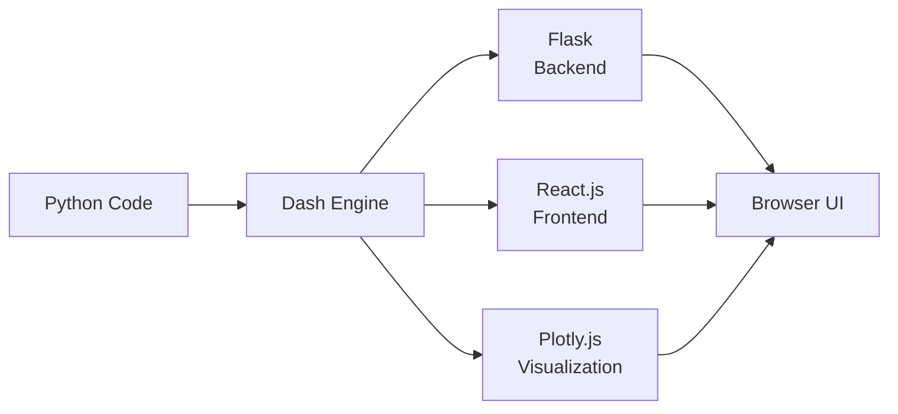

---

## 2. Як працює Dash "під капотом"

### Layout (опис інтерфейсу)

Layout — це клієнтська частина (фронтенд) програми. Вона визначається як ієрархічне дерево компонентів (контейнерів, графіків, кнопок), що відповідає за те, як виглядають елементи та де вони розташовані на сторінці.

### Callback (реактивна логіка)

Це серверна частина програми. Callbacks — це функції Python, які зв'язують візуальні елементи. Вони автоматично викликаються Dash тоді, коли користувач взаємодіє з компонентом (наприклад, обирає значення у списку), визначаючи реакцію системи.

### Як Dash оновлює UI

Коли користувач взаємодіє з інтерфейсом у браузері, HTTP-запит відправляється через веб-сервер (та WSGI-сервер) до бекенду на Flask. Далі виконується відповідна функція callback на Python, і згенерована відповідь повертається назад у браузер (через React), оновлюючи лише необхідну частину сторінки без її повного перезавантаження.

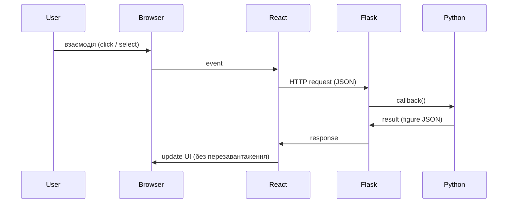

### Dependency graph (Граф залежностей)

Dash автоматично будує граф зворотних викликів (Callback Graph), який візуалізує зв'язки між усіма елементами вводу та виводу, порядок запуску callback-ів та час їхнього виконання.

### Ментальна модель

Уявіть, що ваш Dash-додаток — це живий організм:

- **Layout** — це його тіло та органи чуття (очі, вуха), які взаємодіють зі світом.
- **Callbacks** — це нервова система та мозок.

Коли органи чуття фіксують зміну (`Input`), сигнал іде в мозок (функція Python), мозок приймає рішення і надсилає наказ м'язам (`Output`) для виконання дії.

---

## 3. Layout (інтерфейс)

### html / dcc компоненти

Dash надає два ключові пакети для побудови макету.

**`dash_html_components` (HTML)** — структурний фундамент. Це клієнтська частина програми. Кожен клас тут є прямою Python-обгорткою над стандартним HTML-тегом. Архітектурно вони відповідають за "скелет" сторінки: розміщення блоків, абзаців, відступів та гіперпосилань:

| Python клас | HTML тег |
|-------------|----------|
| `html.Div`  | `<div>`  |
| `html.H1`   | `<h1>`   |
| `html.P`    | `<p>`    |
| `html.A`    | `<a>`    |

**`dash_core_components` (DCC)** — "розумні" компоненти. На відміну від простих HTML-тегів, компоненти DCC є складними React-елементами, які інкапсулюють у собі логіку обробки подій та станів:

| Компонент       | Призначення                         |
|-----------------|-------------------------------------|
| `dcc.Dropdown`  | Випадаючий список                   |
| `dcc.Graph`     | Відображення графіків Plotly        |
| `dcc.Slider`    | Слайдер для числових значень        |
| `dcc.Store`     | Кешування даних у браузері          |
| `dcc.Location`  | Відстеження URL для маршрутизації   |

### Структура layout та вкладеність (Композиція через `children`)

Макет будується за принципом вкладеності. Архітектура Dash використовує патерн **"Композиція"** для побудови інтерфейсу. Базовим контейнером зазвичай виступає `html.Div`, який приймає список інших компонентів через аргумент `children`. Аргумент `children` може приймати число, рядок тексту, один компонент або список інших компонентів.

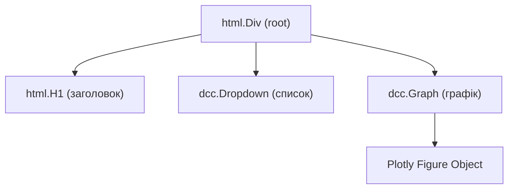

### ID компонентів (Система адресації та Реактивність)

Якщо `children` формує фізичну структуру програми, то **`id`** формує її нервову систему.

- **Унікальна адреса:** Кожен компонент може мати аргумент `id`, який є унікальним текстовим рядком на рівні всього додатка.
- **Міст до бекенду:** Макет (layout) — це клієнтська частина (frontend), а логіка — це серверна частина (backend на базі Flask). Щоб сервер знав, який саме слайдер потягнув користувач, або який саме графік треба оновити, йому потрібні ідентифікатори.
- **Реактивність:** Саме за допомогою `id` функції (callbacks) зможуть слухати зміни (`Input`) або надсилати нові дані (`Output`) до конкретного елемента.

> **Головне правило:** Компонент без `id` — це просто статична декорація (наприклад, заголовок тексту); компонент із `id` — це активний вузол програми, готовий до взаємодії.

### Приклад

```python
import dash_core_components as dcc
import dash_html_components as html

app.layout = html.Div(children=[
    html.H1('Аналіз даних'),

    dcc.Dropdown(
        id='my-dropdown',
        options=[{'label': 'Варіант 1', 'value': '1'}]
    ),

    dcc.Graph(id='my-graph')
])
```

### Типові помилки

- **Перевищення ширини сітки:** Використання колонок (`dbc.Col`), сума ширин яких перевищує 12 одиниць сітки Bootstrap. Це змусить Dash перенести компоненти на новий рядок, ламаючи передбачений макет.
- **Відсутність або дублювання ID:** Присвоєння однакових ідентифікаторів різним компонентам або звернення до ID, якого немає в Layout.
- **Логіка в layout:** Захаращення макету `app.layout` довгою бізнес-логікою. Файл макету повинен бути декларативним описом інтерфейсу. Якщо ви пишете розрахунки всередині `html.Div`, ви робите помилку.

---

## 4. Callbacks (логіка)

### Input / Output / State (Управління потоком даних)

У Dash чітко розмежовано, що є тригером, що є даними, а що є результатом:

| Тип     | Роль                                                                                   |
|---------|----------------------------------------------------------------------------------------|
| `Input`  | **Тригер події.** Будь-яка зміна `Input` автоматично відправляє HTTP-запит на бекенд |
| `Output` | **Місце призначення.** Компонент, який приймає результат роботи функції               |
| `State`  | **Тихий свідок.** Зчитує значення без запуску callback при своїй зміні                |

**Архітектурне обмеження `Output`:** один і той самий `Output` може оновлюватися лише з одного callback-у. Це зроблено для того, щоб уникнути конфліктів і стану гонки (race conditions) під час оновлення інтерфейсу.

**Геніальна архітектура `State`:** уявіть, що у вас є текстове поле і кнопка "Відправити". Якщо зробити текстове поле як `Input`, то кожне натискання клавіші (кожна літера) буде генерувати мережевий запит на сервер і викликати функцію. Зробивши кнопку як `Input`, а текстове поле як `State`, ви кажете системі: *"Запускай функцію лише при кліку на кнопку, але під час запуску захопи поточний текст із поля"*.

### Як працює callback (Магія декораторів та порядок аргументів)

Callback використовує декоратор `@app.callback`, який обгортає звичайну функцію Python. Коли ви обгортаєте звичайну Python-функцію цим декоратором, Dash "реєструє" її у внутрішньому маршрутизаторі Flask.

**Критичне правило — суворий порядок аргументів:** Ваша Python-функція завжди отримує значення у суворо визначеному порядку — **рівно в тому самому, в якому ви перелічили їх у декораторі**. Спочатку в функцію передаються значення всіх `Input`, а потім — усіх `State`. Імена самих аргументів у функції для рушія Dash не мають жодного значення, він орієнтується виключно на позицію аргументу.

```
порядок: Input → State → function args
```

### Приклад callback

```python
from dash.dependencies import Output, Input, State
from dash.exceptions import PreventUpdate

@app.callback(
    Output('my-graph', 'figure'),
    Input('submit-button', 'n_clicks'),
    State('my-dropdown', 'value')
)
def update_graph(n_clicks, selected_value):
    if not n_clicks or not selected_value:
        raise PreventUpdate  # Зупиняє виконання, якщо немає даних

    # Створення графіка на основі selected_value
    fig = create_figure_logic(selected_value)
    return fig
```

### Патерн раннього виходу (PreventUpdate)

За замовчуванням, Dash викликає всі callback-и один раз при першому завантаженні сторінки. Якщо вхідні дані ще не вибрані, функція може видати помилку або перевантажити сервер. Для вирішення цього Dash надає спеціальний виняток `raise PreventUpdate`. Якщо на початку функції перевірити наявність даних і викликати цей виняток, Dash тихо зупинить виконання функції і не буде оновлювати `Output`.

### Що таке реактивність (Граф залежностей)

Реактивність означає, що вам не потрібно писати цикли, які постійно опитують стан елементів. Замість цього система працює на основі подій (event-driven).

**Граф колбеків (Callback Graph):** під час запуску програми Dash аналізує всі ваші декоратори і будує карту залежностей (спрямований ациклічний граф). Система точно знає: *"Зміна випадаючого списку А впливає на графік Б, що своєю чергою є вхідними даними для таблиці В"*.

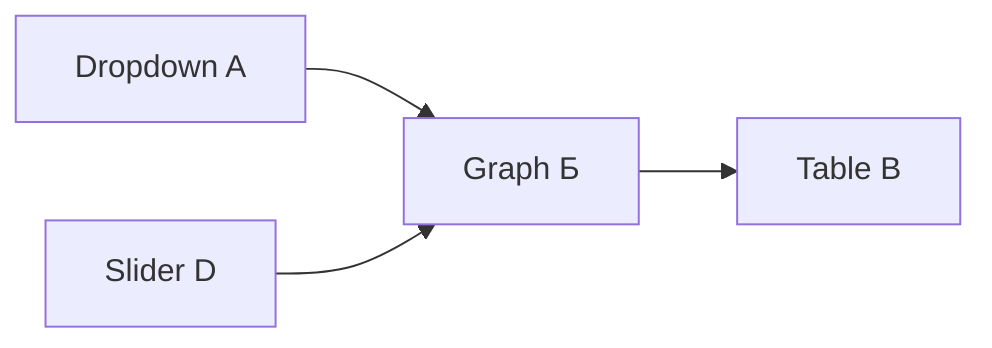

Коли стається подія, Dash через React.js миттєво визначає, яку саме частину інтерфейсу треба перемалювати, залишаючи решту сторінки недоторканою. Ви навіть можете побачити цей граф візуально під час розробки, увімкнувши режим налагодження (кнопка "Callbacks" в інтерфейсі інструментів відладки).

### Типові помилки

- **Callback на неіснуючий компонент:** Декоратор посилається на `id`, який забули додати у `app.layout`.
- **Циклічні залежності:** Коли компонент А оновлює компонент Б, а компонент Б оновлює компонент А. Dash підтримує циркулярні колбеки для синхронізації, але без перевірки контексту (`callback_context`) це створить нескінченний цикл та помилки.
- **Зайві перерахунки:** За замовчуванням Dash запускає всі callback-и під час першого завантаження сторінки. Якщо дані ще не вибрані, це може викликати виняток або перевантажити сервер. Використовуйте `prevent_initial_call=True` у декораторі або повертайте `raise PreventUpdate` всередині функції.

---

## 5. Архітектура Dash-додатку

У міру розростання коду написання всього додатка в одному файлі `app.py` стає антипатерном. Якщо макети, колбеки та логіка генерації графіків знаходяться в одному місці, код перетворюється на нечитабельний хаос на тисячі рядків, який важко підтримувати, тестувати та дебажити. Логіка повинна бути архітектурно розділена.

### Рекомендована структура

```text
my_dash_app/
│
├── app.py                              # Ініціалізація додатку Dash, створення змінної server (app.server)
├── index.py                            # Точка входу, маршрутизація для багатосторінкових додатків
│
├── layouts/                            # Папка з описом інтерфейсу
│   └── main_layout.py                  # Макет сторінки
│
├── callbacks/                          # Папка з реактивною логікою (callback-ами)
│   └── callbacks.py
│
├── utils/                              # Службові модулі та обробка даних
│   ├── dash_reusable_components.py     # Перевикористовувані кастомні компоненти
│   └── figures.py                      # Функції, що генерують об'єкти графіків Plotly
│
├── assets/                             # Статичні файли (CSS-стилі, зображення, шрифти)
│   └── custom-styles.css
│
└── requirements.txt                    # Залежності
```

### Схема модульності

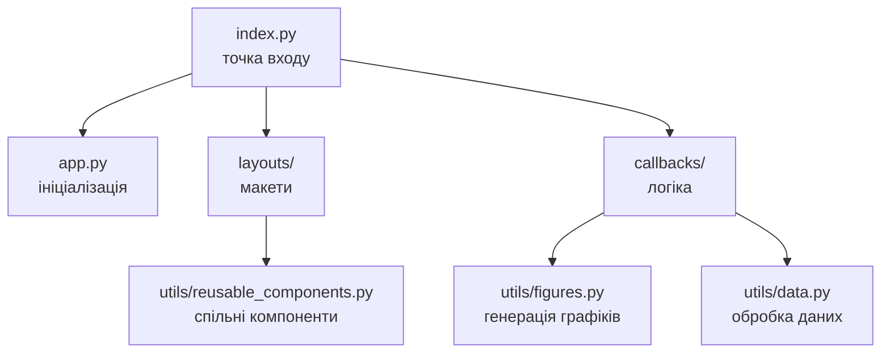

### Принцип Separation of Concerns

Кожен модуль відповідає лише за свою область:

| Файл / Папка                  | Відповідальність                        |
|-------------------------------|-----------------------------------------|
| `app.py`                      | Ініціалізація сервера                   |
| `layouts/`                    | Декларація інтерфейсу                   |
| `callbacks/`                  | Реактивна логіка                        |
| `utils/figures.py`            | Побудова об'єктів Plotly                |
| `utils/data.py`               | Завантаження та трансформація даних     |
| `assets/`                     | CSS, зображення, шрифти                 |

---

## 6. Tabs і модульність

### Чому tabs — це окремі домени

Коли додаток розростається, відображення всіх графіків та панелей управління на одному екрані стає неможливим і візуально перевантажує користувача. Використання вкладок (`dcc.Tabs` або `dbc.Tabs` з бібліотеки Dash Bootstrap Components) дозволяє застосувати архітектурний підхід "розділяй і володарюй".

- **Інкапсуляція контексту:** Вкладки забезпечують зручний спосіб розділити контент на незалежні панелі. Завдяки цьому ви можете показувати кінцевому користувачеві лише невеликі, логічно завершені частини великого проєкту (наприклад, окремо вкладку з інформацією, окремо — робочу зону з повзунками, і окремо — таблицю результатів).
- **Зменшення навантаження:** Такий поділ звільняє цінний простір на екрані та позбавляє користувача необхідності постійно прокручувати сторінку або шукати потрібний графік серед десятків інших.

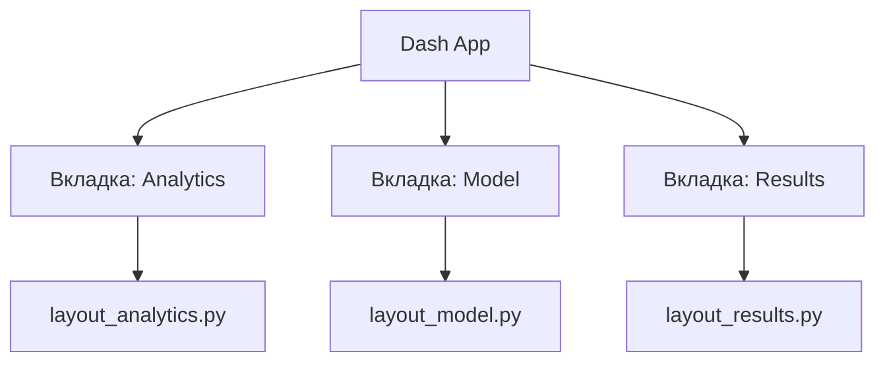

### Як розділяти логіку (Багатосторінкова маршрутизація)

Щоб не тримати весь код у єдиному гігантському файлі макету, професійні Dash-додатки будуються за принципом модульності та багатосторінковості.

- **Базовий контейнер (Shell):** Створюється один основний (головний) макет програми, який містить навігаційну панель та порожній елемент `html.Div` (контейнер для контенту).
- **Слухач URL (`dcc.Location`):** До основного макету додається спеціальний невидимий компонент `dcc.Location`. Він відстежує адресний рядок браузера і повідомляє системі, на якій саме сторінці чи вкладці зараз знаходиться користувач.
- **Динамічна маршрутизація:** Окрема функція зворотного виклику (callback) аналізує атрибут шляху (наприклад, `pathname` з `dcc.Location`). Якщо шлях відповідає сторінці "Аналітика", функція повертає заздалегідь збережений незалежний макет цієї сторінки прямо у порожній `html.Div`. Це дозволяє створювати сотні сторінок, використовуючи лише одну базову функцію маршрутизації, залишаючи код чистим і структурованим.

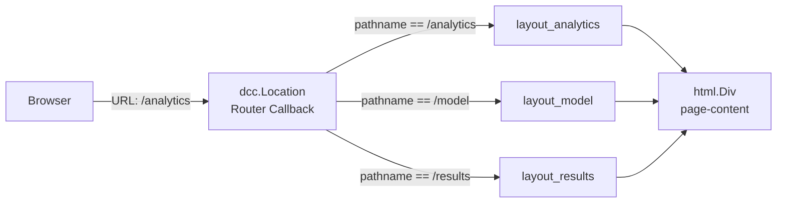

### Чому не можна робити один великий callback

Одним із найсуворіших архітектурних обмежень Dash є те, що **кожен `Output` (конкретна властивість компонента) може оновлюватися виключно з одного єдиного callback-у**.

Новачки часто намагаються обійти це обмеження, запихаючи всі можливі `Input` (кнопки, списки, слайдери з усього додатку) в одну гігантську функцію зворотного виклику, яка керує всіма графіками одночасно. Це є серйозним антипатерном:

- **Некерованість коду:** З додаванням нових функцій такий callback стає величезним і надзвичайно складним. Його стає майже неможливо читати, підтримувати або налагодити.
- **Рішення — Декомпозиція логіки:** Замість того, щоб писати бізнес-логіку прямо всередині callback-у, слід використовувати окремі допоміжні функції (helper functions) для кожного конкретного процесу або трансформації даних. Сам callback має залишатися "тонким" — він лише отримує тригери (`Input`), викликає відповідну допоміжну функцію з іншого модуля і повертає готовий результат у `Output`. Це робить логіку вашого додатку модульною та придатною для повторного використання.

---

## 7. Data Flow у Dash

### Як дані рухаються

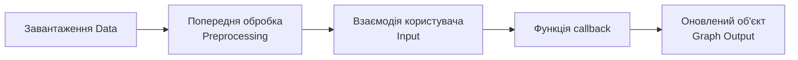

### Де робити обробку

#### ❌ НЕ в callback

Не читайте величезні датасети безпосередньо всередині функції callback. Оскільки callback викликається при кожному кліці, це призведе до значних затримок у відповіді та заблокує сервер для інших користувачів.

Якщо ви помістите команду `pd.read_csv('huge_data.csv')` або важкий SQL-запит всередину цієї функції, відбудеться наступне:

- Кожен зсув слайдера на один крок генеруватиме новий мережевий запит до сервера.
- Сервер (який працює на базі Flask) буде змушений заново читати гігабайтний файл з жорсткого диска або чекати відповіді від бази даних для кожного мікро-кліку.
- Оскільки ресурси сервера обмежені, це призведе до величезних затримок, і сервер просто заблокується для всіх інших користувачів.

```python
# ❌ ПОГАНО — НЕ РОБІТЬ ТАК
@app.callback(Output('graph', 'figure'), Input('dropdown', 'value'))
def update_graph(value):
    df = pd.read_csv("huge_data.csv")  # ❌ читається КОЖЕН РАЗ
    df["date"] = pd.to_datetime(df["date"])  # ❌ обробляється КОЖЕН РАЗ
    return px.line(df[df["category"] == value], x="date", y="sales")
```

#### ✅ В окремих функціях

Важкі операції та завантаження даних слід виконувати на глобальному рівні (поза callback-ами) до старту сервера. Callback повинен лише отримувати вхідні фільтри, робити "легку" вибірку вже завантаженого DataFrame і повертати графік.

Коли ви пишете `df = pd.read_csv('data.csv')` поза межами будь-яких функцій, цей датафрейм стає глобальною змінною. Він завантажується в оперативну пам'ять (RAM) сервера **лише один раз** під час старту додатку. Оперативна пам'ять працює в тисячі разів швидше за жорсткий диск.

### Ідеальний lifecycle (розподіл по фазах)

**Фаза 1: Важка атлетика — Глобальний рівень (виконується 1 раз)**

```python
# ✅ Завантаження Data — один раз при старті сервера
df = pd.read_csv("data.csv")

# ✅ Попередня обробка (Preprocessing) — один раз
df["date"] = pd.to_datetime(df["date"])
df_aggregated = df.groupby(["date", "category"]).sum().reset_index()

app = Dash(__name__)
# ... визначення layout ...
```

**Фаза 2: Легка гімнастика — Рівень Callback (виконується N разів)**

```python
# ✅ ПРАВИЛЬНО — легкі операції всередині callback
@app.callback(Output('graph', 'figure'), Input('dropdown', 'value'))
def update_graph(chosen_value):
    # ✅ Легка вибірка вже завантаженого DataFrame
    df_filtered = df_aggregated[df_aggregated["category"].isin(chosen_value)]
    
    # ✅ Оновлений об'єкт графіка
    fig = px.line(df_filtered, x="date", y="sales")
    return fig
```

---

## 8. Performance і оптимізація

### Caching (кешування) через dcc.Store

У Dash для уникнення повторних важких запитів та кешування даних у сесії користувача використовується компонент `dcc.Store`. Він дозволяє непомітно зберігати проміжні обчислені дані (JSON або словники) безпосередньо у пам'яті веб-браузера конкретного користувача (від 2 до 10 МБ). Це дозволяє блискавично передавати дані між різними callback-ами без повторних розрахунків.

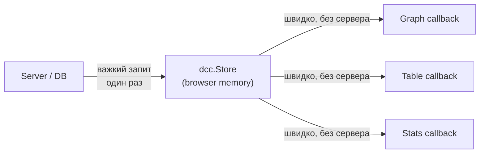

### Чому dcc.Store вирішує проблему персоналізованих даних

Існує суворе правило: **ніколи не змінюйте глобальний DataFrame всередині `callback`**. Оскільки глобальна змінна спільна для всіх користувачів, зміна її одним клієнтом зламає дані для іншого.

Для вирішення цієї проблеми:

1. Створюється окремий `callback`, який асинхронно стягує свіжі дані.
2. Дані перетворюються на формат JSON (`df.to_dict("records")`).
3. JSON зберігається в `dcc.Store` — прямо в браузері конкретного користувача.
4. Інші callback-и беруть дані з `dcc.Store` (через `State` або `Input`), не навантажуючи сервер.

### Уникнення повторних обчислень

- Завжди завантажуйте дані та проводьте масштабні перетворення (злиття, очищення) лише один раз поза функціями зворотного виклику.
- Обробляйте дані порціями. Якщо у вас є масивний загальний файл, на етапі ініціалізації розбийте його на менші, специфічні DataFrames, з якими легше і швидше працювати всередині конкретного callback-у.

---

## 9. Anti-patterns (дуже важливо)

### ❌ Глобальні callbacks (модифікація стану)

Зміна глобальних змінних всередині callback-ів. Оскільки Dash за замовчуванням працює багатопоточно (через Flask) і обслуговує різних користувачів, модифікація глобального DataFrame одним користувачем може зламати сесію іншому. Зберігати сесійний стан потрібно через `dcc.Store` або `State`.

```python
# ❌ НЕБЕЗПЕЧНО — глобальний стан мутується в callback
df_global = pd.read_csv("data.csv")

@app.callback(...)
def callback(value):
    df_global["new_col"] = df_global["col"] * 2  # ❌ зламає іншого користувача!
    return fig
```

### ❌ Merge всіх даних в один dataframe (всередині логіки взаємодії)

Завантаження абсолютно всього файлу в пам'ять callback-а і його там обробка. Антипатерн — завантажувати всі колонки, навіть ті, що не використовуються. Це витрачає пам'ять. Правильно — створювати під-датафрейми, що містять тільки необхідні стовпці для конкретного графіку.

### ❌ Логіка в layout

Захаращення макету `app.layout` довгою бізнес-логікою. Файл макету повинен бути декларативним описом інтерфейсу. Якщо ви пишете розрахунки всередині `html.Div`, ви робите помилку.

### ❌ Один великий callback

Запихання всіх `Input` програми в одну гігантську функцію зворотного виклику, яка керує всіма графіками одночасно. З додаванням нових функцій такий callback стає величезним і надзвичайно складним для читання та підтримки.

### ❌ Дублювання коду

Повторне створення десятків однакових кнопок або графіків вручну у файлі `app.py`. Натомість слід:

- Створити перевикористовувані компоненти (wrapper functions) у модулі `dash_reusable_components.py`.
- Використовувати "Шаблонні зворотні виклики" (Pattern-Matching Callbacks з параметром `MATCH`), які дозволяють керувати нескінченною кількістю динамічних компонентів одним callback-ом.

---

## 10. Best Practices

### Як писати чистий Dash

- Рефакторте логіку: виносьте генерацію макетів, графіків та кастомних елементів у папку `utils/`.
- Використовуйте інструменти автоформатування коду (наприклад, Black), щоб код залишався читабельним, особливо в ієрархічних структурах макетів.
- Блокуйте первинні виконання callback-ів, використовуючи `prevent_initial_call=True` або генеруючи `raise PreventUpdate` всередині функції, коли вхідні дані `None`.

```python
# ✅ prevent_initial_call на рівні декоратора
@app.callback(
    Output('graph', 'figure'),
    Input('dropdown', 'value'),
    prevent_initial_call=True  # ✅ не запускається при завантаженні
)
def update(value):
    ...
```

### Як масштабувати

- Переходьте до багатосторінкової архітектури за допомогою `dcc.Location` та `dcc.Link` замість "впихання" всього на один екран.
- Використовуйте словники в якості ID (`{'type': 'chart', 'index': MATCH}`) для створення динамічних інтерфейсів, де користувач може додавати елементи "на льоту".
- Застосовуйте `dcc.Loading` (спіннери) навколо важких графіків, щоб інформувати користувача про завантаження даних.

```python
# ✅ dcc.Loading — показує спіннер під час обчислення
dcc.Loading(
    id="loading",
    type="circle",
    children=dcc.Graph(id='heavy-graph')
)
```

### Як мислити як архітектор

- Відокремлюйте отримання даних від їх візуалізації.
- Завжди аналізуйте та перетворюйте "широкі" дані в "довгий" (tidy) формат за допомогою Pandas *до* побудови графіків. Plotly Express ідеально працює саме з довгим форматом.
- Використовуйте інструменти WSGI-сервери типу Gunicorn, щоб масштабувати розгортання в production.

---

## 11. Глибинний архітектурний рівень

### Архітектурний патерн: Single-Page Application (SPA)

З архітектурної точки зору, Dash реалізує патерн **Single-Page Application (SPA — односторінковий веб-додаток)**. Замість того, щоб змушувати розробника писати окремі шари для бази даних, серверного API та клієнтського інтерфейсу, Dash бере роль системного інтегратора на себе.

### Flask (Бекенд та невидиме API)

Ваш Python-код не виконується в браузері. Під капотом об'єкта `app` працює класичний, надійний веб-сервер **Flask**.

- **Що він робить:** Коли ви запускаєте Dash, Flask починає прослуховувати вказаний порт (зазвичай 8050) і діє як WSGI-сервер для обробки HTTP-запитів.
- **Магія абстракції:** У традиційному веб-програмуванні вам довелося б самостійно писати маршрути (routes) для кожного запиту та вручну обробляти формати даних. Dash приховує цю складність: він автоматично генерує невидимі REST API ендпоінти для кожної вашої функції `callback`.

### React.js (Фронтенд та управління станом)

Браузер не розуміє Python — він розуміє лише HTML, CSS та JavaScript. Саме тут у гру вступає **React.js**.

- **Що він робить:** Коли ви описуєте інтерфейс за допомогою модулів `dash_html_components` (наприклад, `html.Div` або `html.H1`), Dash бере ці Python-об'єкти і **серіалізує** їх у формат JSON.
- **Магія абстракції:** React.js на стороні клієнта отримує цей JSON і "на льоту" будує з нього дерево віртуального DOM, перетворюючи на реальні HTML-теги в браузері. React також діє як "слухач": він фіксує кожну дію користувача (наприклад, вибір елемента в випадаючому списку) і готує дані для відправки назад на сервер.

### Plotly.js (Графічний рушій)

Для відмальовування самих діаграм використовується бібліотека **Plotly.js**, яка своєю чергою побудована поверх потужного інструменту маніпуляції документами на основі даних — **D3.js** (Document-Driven Data).

- **Що він робить:** Коли сервер повертає об'єкт графіка, Plotly.js відповідає за його рендеринг у браузері з використанням SVG або WebGL, що забезпечує масштабування, наведення (hover) та інтерактивність діаграм.

### Повний цикл мережевої взаємодії

Давайте простежимо шлях одного кліку користувача (наприклад, зміну параметра на слайдері):

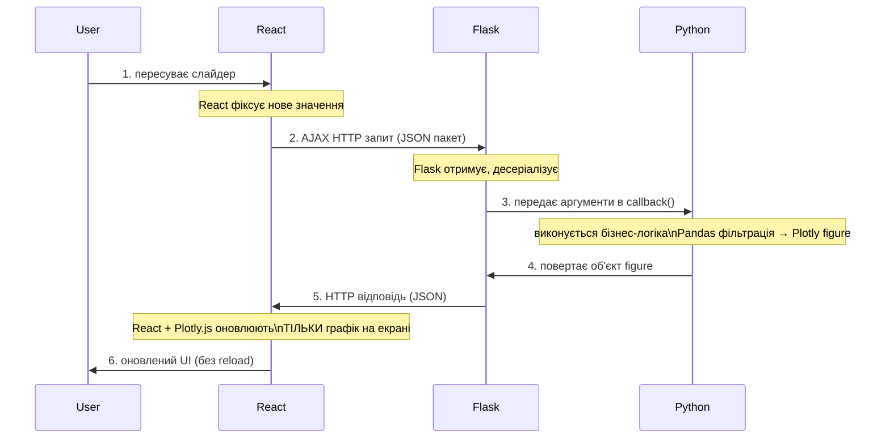

### Архітектурний висновок про мережу

Dash звільняє фахівця з даних від необхідності бути full-stack розробником, приховуючи складні процеси серіалізації та HTTP-комунікації. Однак, як архітектор, ви завжди маєте пам'ятати про **"пляшкове горлечко"** цієї системи — мережу.

Оскільки між фронтендом та бекендом літають JSON-пакети, **ніколи не передавайте через `callback` сирі датафрейми на гігабайти**; виконуйте важкі фільтрації на бекенді, а в браузер повертайте лише легкі агреговані результати або координати для графіка.

---

## 12. Висновок

### Мислення розробника Dash

Мислення розробника Dash — це поєднання декларативного дизайну (через Layout) з реактивною логікою (через Callbacks). Грамотна архітектура базується на модульності: макети мають бути відокремлені від логіки побудови графіків і маніпуляцій з даними. Уникаючи виконання складних операцій усередині зворотних викликів і використовуючи кешування сесії в `dcc.Store`, ви зможете створювати продуктивні, масштабовані та надійні аналітичні програми, здатні працювати з великими потоками даних.

### Три стовпи Dash

| Компонент  | Роль               | Аналогія             |
|------------|--------------------|----------------------|
| **Layout** | Декларація UI      | Тіло організму       |
| **Callback** | Реактивна логіка | Нервова система      |
| **Data**   | Джерело істини     | Кров організму       |

### Архітектурна модель мислення

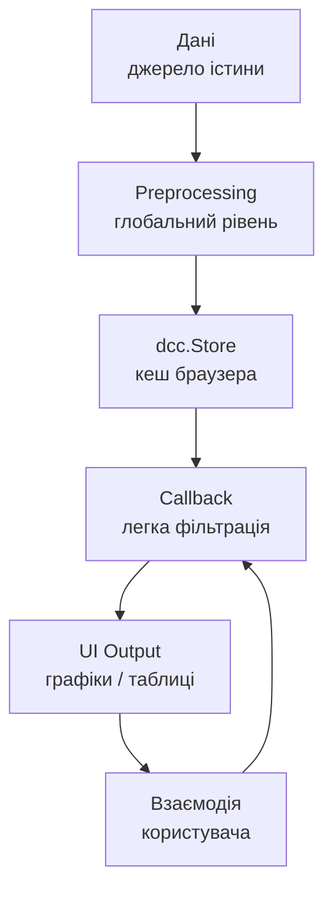

### Якщо ти це зрозумів

> Ти вже не просто **користувач Dash**.
> Ти мислиш як **архітектор системи потоків даних**.

---

### Наступний рівень (для поглибленого вивчення)

Якщо хочеш рухатися далі:

- **Pattern-Matching Callbacks** (`MATCH`, `ALL`) — динамічне керування нескінченною кількістю компонентів
- **State management** — синхронізація стану як у React
- **Інтеграція з PostGIS + FastAPI** — production архітектура для геосторонніх даних
- **Gunicorn + Docker** — масштабоване розгортання Dash у production
