# Урок 23 — Діаграми: Stack, Queue, Deque

Мermaid-схеми для візуалізації потоку даних у стеках, чергах та двосторонніх чергах.

---

## 1. Stack (LIFO) — Потік «Переривання»

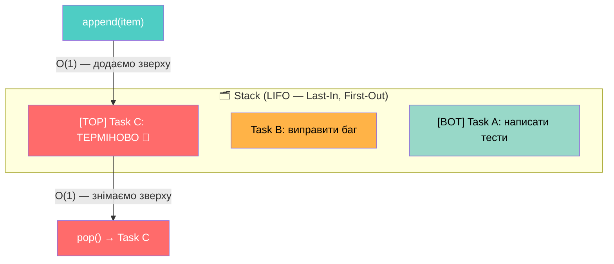

---

## 2. Queue (FIFO) — Потік «Справедливість»

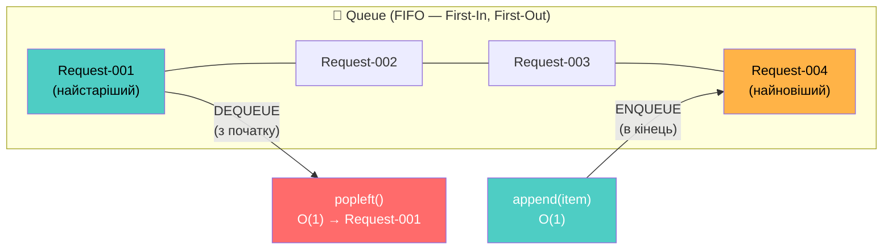

---

## 3. Деградація list при використанні як черга

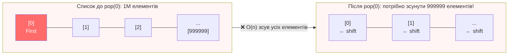

### Рішення: `deque.popleft()` — O(1)

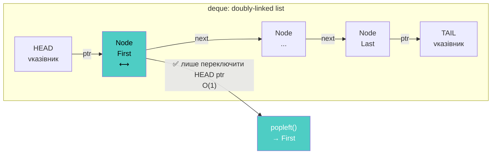

---

## 4. Deque — Двосторонній Потік

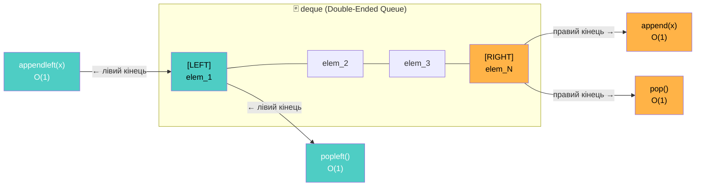

---

## 5. Circular Buffer (maxlen=5)

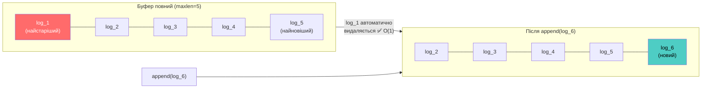

---

## 6. Call Stack — Рекурсія fact(3)

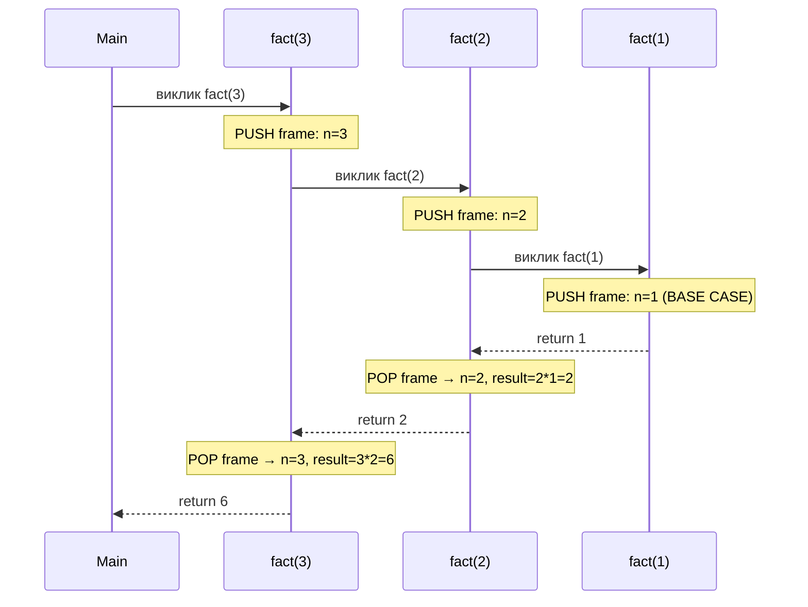

---

## 7. DFS vs BFS — Порядок обходу

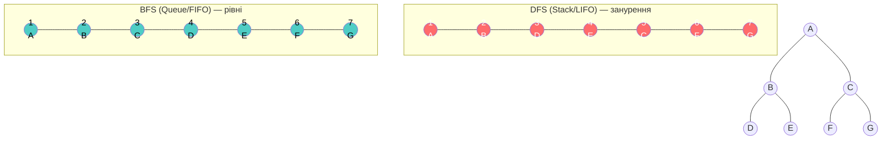

---

## 8. Порівняльна таблиця: list vs deque vs queue.Queue

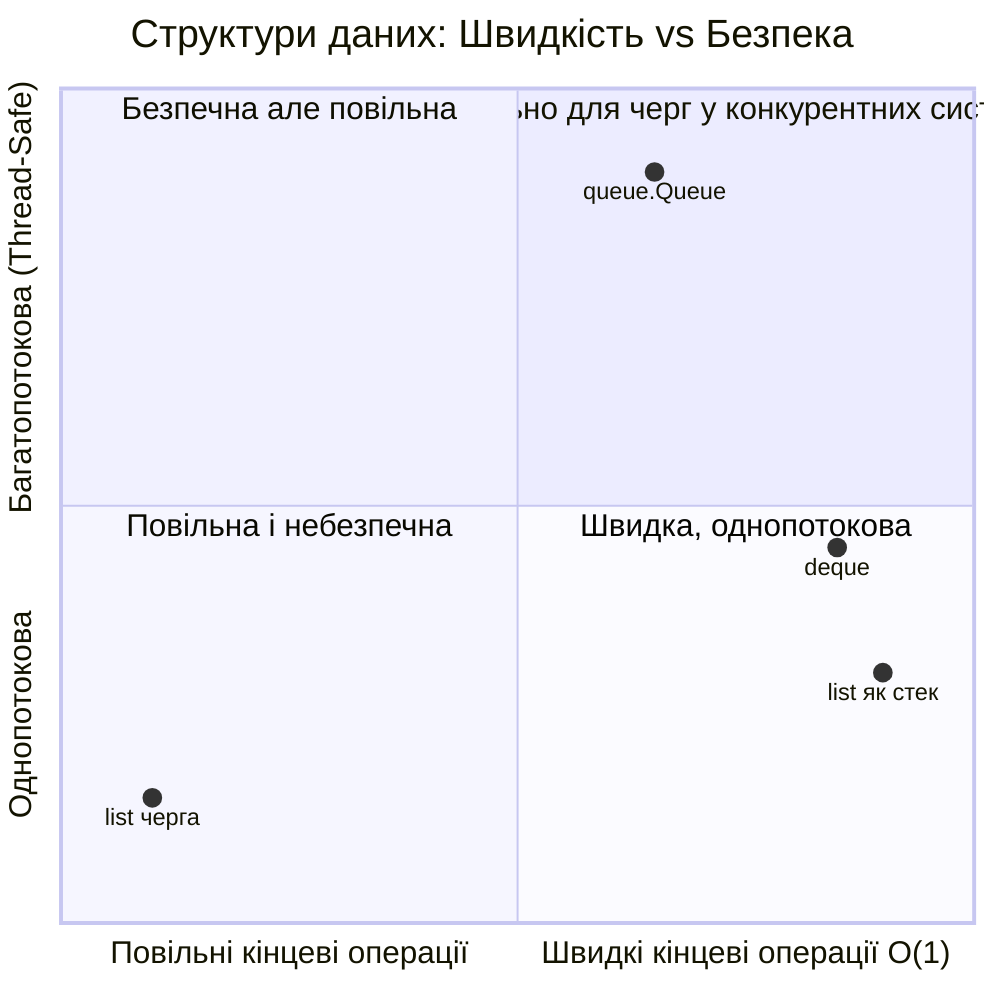

---

## 9. Producer-Consumer з `queue.Queue`

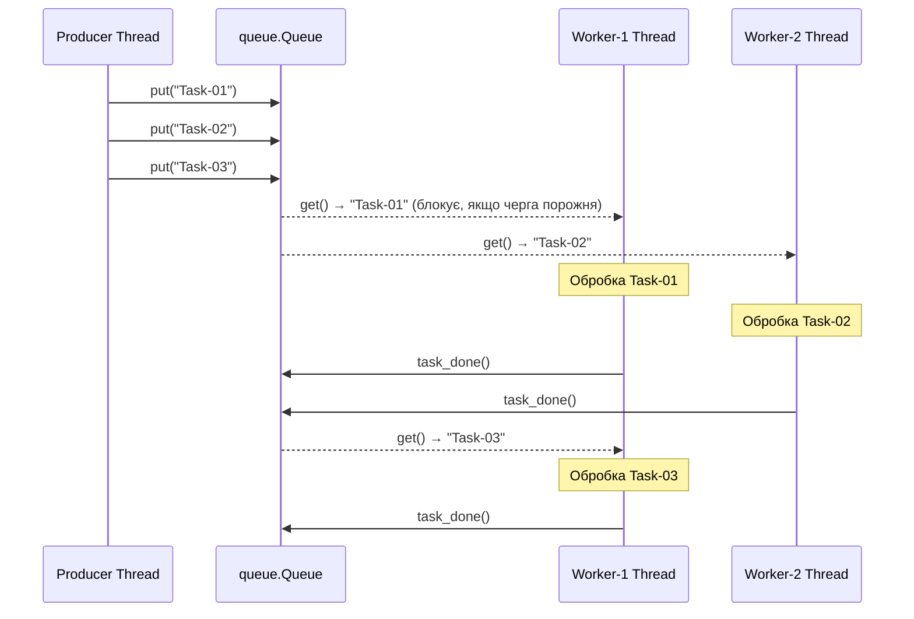

---

## 10. Архітектурне рішення: коли що використовувати

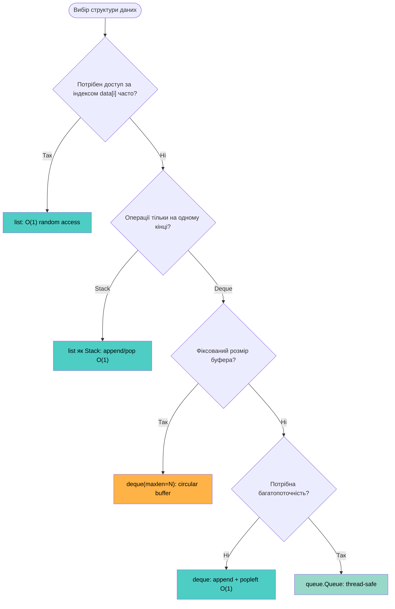
